# Nano Banana Prompts for Image Editing 🍌

<p>
  <a href="README.md"></a>&nbsp;
  <a href="README_zh.md"></a>
</p>

Try on a new outfit before buying it, turn a product snapshot into a shop-ready image, preview furniture in your room, or give an old photo a fresh look. This collection helps you explore what you can do with your own images using Nano Banana—from practical touch-ups to playful style transformations.

Browse the before-and-after examples to find an edit you want to try. Each case gives you a short workflow and a complete prompt to adapt to your images, so you can get started without writing from scratch. Curated by SeeAPI, with English and Simplified Chinese versions.

**27 editing prompts · 27 cases with previews · Updated September 17, 2026**

⭐ Star this collection to save ideas for your next image edit.

<a id="featured"></a>

## ✨ Featured Edits

| [Virtual Clothes Try On](#p01-complete-look) | [Product Background Replacement](#p02-product-background) | [Colorful Yarn Embroidery](#p28-colorful-yarn-embroidery) | [Group Photo](#p03-shared-portrait) |
| :---: | :---: | :---: | :---: |
| <b>Before → After</b><br><a href="assets/portraits/reference-man.png"></a> <a href="assets/portraits/reference-outfit.png"></a> &nbsp;→&nbsp; <a href="assets/portraits/result-virtual-try-on.jpg"></a> | <b>Before → After</b><br><a href="assets/products/reference-seeapi-mug.jpg"></a> &nbsp;→&nbsp; <a href="assets/products/result-mug-ice-background.jpg"></a> | <b>Before ↓ After</b><br><a href="assets/colorful-yarn-embroidery/source-example-01.webp"></a> | <b>Before → After</b><br><a href="assets/portraits/reference-man.png"></a> <a href="assets/portraits/reference-woman.png"></a> &nbsp;→&nbsp; <a href="assets/portraits/result-group-photo-updated.jpg">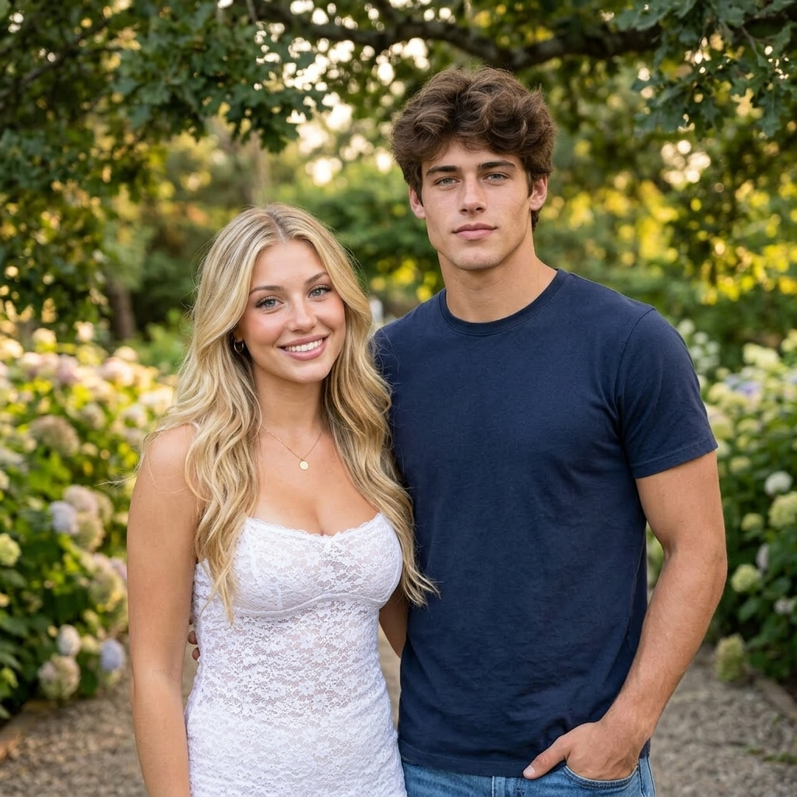</a> |
| `Person + outfit → virtual try-on` | `Product + background description → new scene` | `Photo → colorful embroidery` | `Two portraits → group photo` |

## 📑 Contents

**Repository Guide**

- [✨ Featured Edits](#featured)
- [🧭 Choose Your Model](#how-to-use)
- [📄 License](#license)

**Prompt Categories**

- [👗 Portraits & Outfits](#portraits-outfits)
- [🛍️ Products & Commercial Images](#products-commercial)
- [🏡 Homes & Spaces](#homes-spaces)
- [🎨 Style Transformations & Playful Edits](#style-transformations)
- [🪄 Photo Restoration & Local Adjustments](#restoration-adjustments)

<a id="how-to-use"></a>

## 🧭 Choose Your Model

| Model | Best for | Note |
| --- | --- | --- |
| Nano Banana | Revisiting original-model cases | Legacy |
| Nano Banana 2 | Everyday edits, multiple references | Default pick |
| Nano Banana 2 Lite | Simple edits, low-cost batches | 1K only; weaker fit for multi-reference and sequential edits |
| Nano Banana Pro | Complex refinement, brand consistency | Pick for demanding tasks |

<a href="https://nanobanana.seeapi.com/">
  
</a>

<a id="portraits-outfits"></a>

## 👗 1. Portraits & Outfits

<a id="p01-complete-look"></a>

### 1.1. Virtual Clothes Try On

#### 🖼️ Preview

| Before | After |
| :---: | :---: |
| <a href="assets/portraits/reference-man.png"></a> &nbsp; <a href="assets/portraits/reference-outfit.png"></a><br>Person + outfit | <a href="assets/portraits/result-virtual-try-on.jpg"></a> |

#### 👇 Workflow

`Person + outfit → virtual try-on`

#### 📝 Full Prompt

```text
Edit Image 1 using all the clothing and accessories shown in Image 2 and any additional reference images. Dress the person in the complete reference look, including the top, bottom or dress, outerwear, shoes, bag, jewelry, eyewear, belt, and headwear wherever supplied. Transfer every visible outfit item without omitting small accessories or inventing extra pieces. Preserve each item's color, material, pattern, shape, and recognizable design details.

Keep the person's face, identity, hairstyle, skin tone, body shape, and proportions unchanged. Fit and layer the garments naturally on this body, with realistic fabric drape, closures, contact shadows, and appropriate accessory placement. Keep left and right shoes consistent. Match the original scene's perspective, lighting, and color temperature. Preserve the original pose and background where possible; if the source crops out the feet, extend the framing naturally to show the complete look. Produce one coherent, photorealistic full-body fashion photograph, without a collage, added text, or duplicated body parts.
```

<sub>Prompt by SeeAPI</sub>

<a id="p04-mini-me"></a>

### 1.2. Mini Me

#### 🖼️ Preview

| Before | After |
| :---: | :---: |
| <a href="assets/portraits/reference-boy.png"></a><br>Portrait | <a href="assets/portraits/result-mini-me.jpg">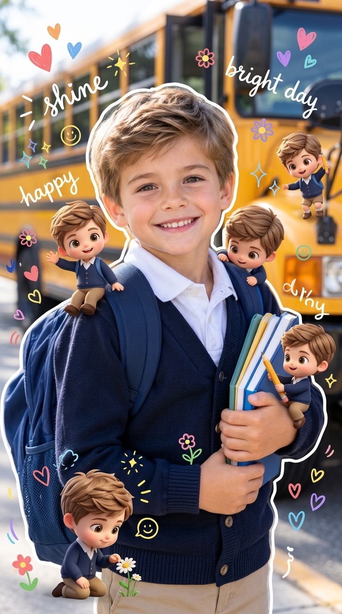</a> |

#### 👇 Workflow

`Portrait → Mini Me`

#### 📝 Full Prompt

```text
Surrounding the realistic main subject are multiple cute, 3D-style chibi miniatures of the same person, with identical facial features, hairstyle, body proportions, and outfit.
The chibi figures are naturally distributed around the subject, interacting playfully with her or nearby elements in a charming, non-intrusive way.

Overlay the image with vibrant, hand-drawn doodle effects: soft white outlines around the subject, playful sparkles, doodle hearts, tiny flowers, smiley icons, and floating white handwritten phrases like "shine", "bright day", and "happy".

The style seamlessly blends hyper-realistic photography with colorful, soft cartoon illustrations.
Keep the original face, body shape, and proportions of the main subject unchanged.
```

<sub>User-supplied prompt · Original author and source pending</sub>

<a id="p05-pet-photobomb"></a>

### 1.3. Pet Photobomb Selfie

#### 🖼️ Preview

| Before | After |
| :---: | :---: |
| <a href="assets/portraits/reference-woman.png"></a> &nbsp; <a href="assets/portraits/reference-cat.png"></a><br>Person + pet | <a href="assets/portraits/result-pet-selfie.jpg"></a> |

#### 👇 Workflow

`Person + pet → playful selfie`

#### 📝 Full Prompt

```text
Use Image 1 as the identity reference for the person and Image 2 as the identity reference for their pet. Keep the person's recognizable face and the pet's species, coat markings, and distinctive features.

Create a hilarious, extreme 0.5x wide-angle selfie from a low angle looking up, playfully photobombed by the pet. The pet's nose and face fill most of the foreground in soft, blurry detail, with comic wide-angle distortion. Behind the pet, the person wears a cozy cream knitted sweater and laughs helplessly. Keep enough of their face visible to recognize them.

They are sitting inside a warm, aesthetic café filled with wooden furniture, hanging plants, pastries, and soft golden afternoon light. Curved perspective, casual slice-of-life, candid moment, high-ISO smartphone photography, natural imperfections. Preserve the person's identity without imposing a different age or gender. Output a single believable photograph.
```

<sub>Based on a user-supplied prompt · Original author and source pending · Adapted by SeeAPI: reference binding, clearer pet foreground, and age/gender-neutral wording</sub>

<a id="p06-hairstyle-grid"></a>

### 1.4. 3 × 3 Hairstyle Changer

#### 🖼️ Preview

| Before | After |
| :---: | :---: |
| <a href="assets/portraits/reference-hairstyle.png"></a><br>Portrait | <a href="assets/portraits/result-hairstyle-grid.jpg"></a> |

#### 👇 Workflow

`Portrait → 9 hairstyles`

#### 📝 Full Prompt

```text
Using the uploaded portrait, create one clean 3 × 3 grid with exactly nine equal-sized head-and-shoulders portraits of the same person. Preserve the exact facial identity, face shape, age, skin tone, facial expression, facial hair if present, clothing, camera angle, background, and lighting in every cell. Only the scalp hairstyle changes. Keep the original hair color consistent across all nine cells.

Show these nine visibly distinct hairstyles in reading order: (1) close buzz cut, (2) textured pixie crop, (3) short side-parted undercut, (4) chin-length blunt bob, (5) shoulder-length shag with curtain bangs, (6) long straight hair with a center part, (7) long loose waves with a side part, (8) voluminous tight curls, (9) sleek high bun with a clean hairline. Adapt each hairstyle realistically to this person's scalp and face without changing their identity or gender presentation. These are hairstyle options for any gender; do not masculinize or feminize the face.

Keep hair fully visible within each cell with consistent framing and narrow, even gutters. Make all nine styles clearly different; no repeated cuts, missing cells, extra faces, labels, or watermarks.
```

<sub>Prompt by SeeAPI</sub>

<a id="p07-linkedin-headshot"></a>

### 1.5. LinkedIn Profile Picture

#### 🖼️ Preview

| Before | After |
| :---: | :---: |
| <a href="assets/portraits/reference-woman.png"></a><br>Portrait | <a href="assets/portraits/result-linkedin.jpg">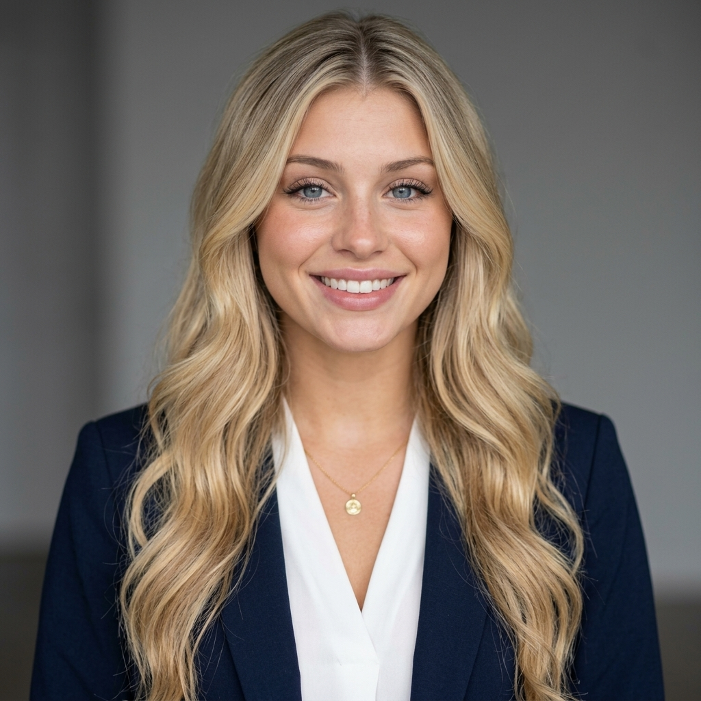</a> |

#### 👇 Workflow

`Portrait → professional headshot`

#### 📝 Full Prompt

```text
Edit the uploaded portrait into a polished, approachable LinkedIn profile photograph. Preserve the person's exact identity, facial structure, age, skin tone, hairstyle, and natural skin texture. Do not reshape the face, lighten skin, or change gender presentation.

Use a centered head-and-shoulders composition, upright relaxed posture, direct eye contact, and a subtle natural smile. Dress the person in neat, understated professional clothing suited to their existing presentation. Use a softly blurred neutral gray background and flattering, soft studio light with gentle facial shadows and natural catchlights. Retouch only temporary distractions; keep distinctive features intact.

Output a square photorealistic image with comfortable headroom and enough space around the face for a circular profile crop. No text, logos, heavy beauty filters, or artificial plastic skin.
```

<sub>Prompt by SeeAPI</sub>

<a id="p03-shared-portrait"></a>

### 1.6. Group Photo

#### 🖼️ Preview

| Before | After |
| :---: | :---: |
| <a href="assets/portraits/reference-man.png"></a> &nbsp; <a href="assets/portraits/reference-woman.png"></a><br>Person A + person B | <a href="assets/portraits/result-group-photo-updated.jpg"></a> |

#### 👇 Workflow

`Two portraits → group photo`

#### 📝 Full Prompt

```text
Combine the person in Image 1 and the person in Image 2 into one natural photograph of them standing side by side in a softly lit outdoor setting. Preserve each person's distinct facial features, age, skin tone, hairstyle, and recognizable identity. Do not blend their faces or turn them into the same person.

Use a single camera viewpoint and consistent perspective, scale, lighting, color temperature, and depth of field. Give them relaxed, friendly expressions and a believable shared pose, with anatomically correct hands and natural spacing. Adapt clothing folds and shadows as needed while preserving their original outfits. Output one photorealistic shared portrait, with exactly two people, no split screen, borders, added text, or collage seams.
```

<sub>Prompt by SeeAPI</sub>

<a id="products-commercial"></a>

## 🛍️ 2. Products & Commercial Images

<a id="p02-product-background"></a>

### 2.1. Product Background Replacement

#### 🖼️ Preview

| Before | After |
| :---: | :---: |
| <a href="assets/products/reference-seeapi-mug.jpg"></a><br>Product | <a href="assets/products/result-mug-ice-background.jpg"></a> |

#### 👇 Workflow

`Product + background description → new scene`

#### 📝 Full Prompt

```text
Edit the uploaded product photo. Replace the background with [background_description]. Keep the product's exact silhouette, proportions, color, material, logo, label text, and packaging details unchanged. Do not redesign or duplicate it.

Integrate the product naturally into the new setting with a believable scale, perspective, surface contact, and matching light direction, reflections, and shadows. Keep the product clearly visible and in sharp focus; use background depth of field only where appropriate. Produce one polished commercial photograph without adding text, decorative logos, or unrelated products.
```

<sub>Prompt by SeeAPI</sub>

<a id="p08-white-background-product"></a>

### 2.2. White Background Product Photo

#### 🖼️ Preview

| Before | After |
| :---: | :---: |
| <a href="assets/products/reference-seeapi-mug.jpg"></a><br>Product | <a href="assets/products/result-mug-white-background.jpg">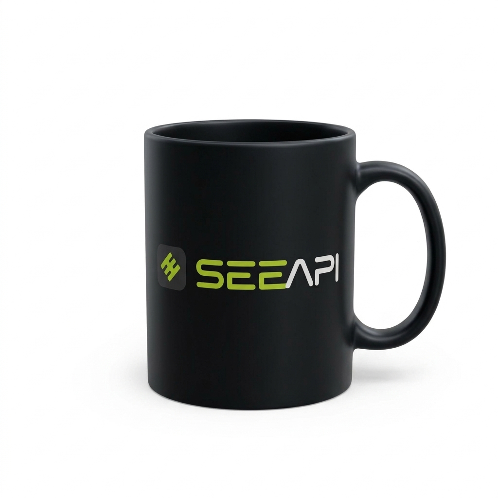</a> |

#### 👇 Workflow

`Product → white background`

#### 📝 Full Prompt

```text
Turn the uploaded product photo into a clean e-commerce studio photograph on a pure white (#FFFFFF) background. Isolate only the intended product, removing the original surroundings and unrelated props. Preserve its exact shape, proportions, color, material, texture, logo, label text, and all visible components.

Center the product with even margins and keep it fully inside the frame. Use soft, even studio lighting, accurate colors, sharp edges, and a subtle natural contact shadow directly beneath it. Remove background color spill and edge halos without erasing transparent parts, fine details, or realistic reflections. Do not redesign the product, invent hidden features, add promotional text, or add decorative objects.
```

<sub>Prompt by SeeAPI</sub>

<a id="p09-floating-food-ad"></a>

### 2.3. Floating Food Advertisement

#### 🖼️ Preview

Original post example

<a href="assets/floating-food-ad/source-example-01.webp">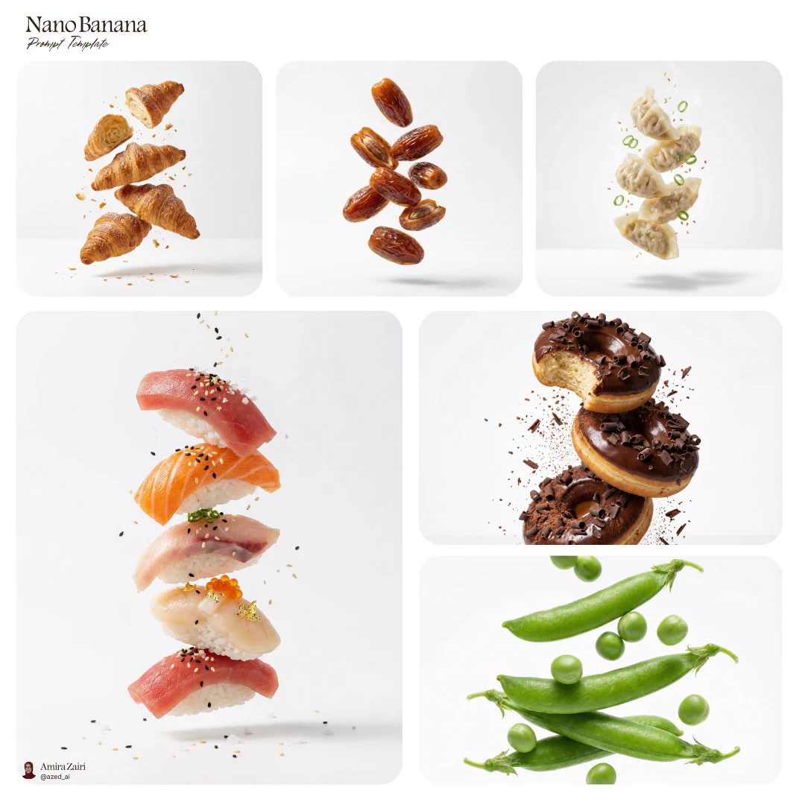</a>

#### 👇 Workflow

`Food + ingredient details → floating food ad`

#### 📝 Full Prompt

```text
Use the uploaded food photo as the reference for [subject]. Separate its recognizable layers into an appetizing vertical arrangement suspended above a white tabletop. Add small airborne accents of [ingredient_bits] around the stack. Retain the food's characteristic ingredients, colors, proportions, and surface textures.

Keep generous white space around the arrangement. Illuminate it with a large diffused studio light so moist surfaces, crumbs, and cut edges remain detailed. Give each layer believable depth and a consistent perspective, with a faint shadow below the composition. Produce a polished food campaign image with no added lettering or unrelated packaging.
```

<sub>Inspired by [@azed_ai](https://x.com/azed_ai/status/2073769875940786430) · [Source: X](https://x.com/azed_ai/status/2073769875940786430) · [Source prompt](https://x.com/azed_ai/status/2073769888691441721) · Reference-image editing prompt rewritten by SeeAPI; not a verbatim copy; untested · Original-post examples; not tests of the rewritten prompt.</sub>

<a id="p10-low-angle-product-campaign"></a>

### 2.4. Low-Angle Product Campaign

#### 🖼️ Preview

Original post example

<a href="assets/low-angle-product-campaign/source-example-01.webp">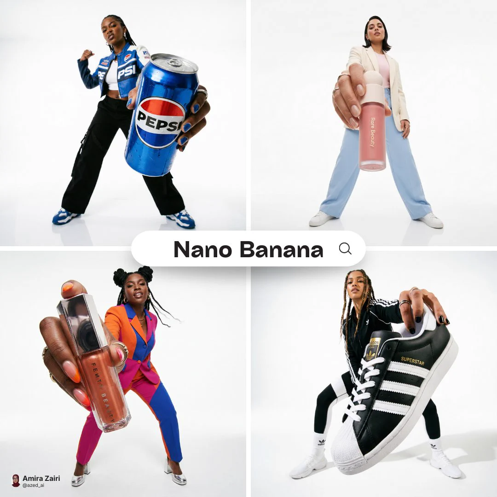</a>

#### 👇 Workflow

`Product + portrait → low-angle ad`

#### 📝 Full Prompt

```text
Build a fashion advertisement around the [product name] shown in Image 1. Place it in a person's outstretched hand very near a low-positioned camera, making the package the largest and sharpest element. Show the person's full-body stance farther behind it against a white studio backdrop. If Image 2 is provided, preserve that person's identity.

Retain the product's branding, legible label, geometry, and finish. Use a confident pose, vivid clothing, bright diffused illumination, and a natural grip with correct fingers. Let camera perspective create the size contrast without stretching the package. Keep the figure slightly softer than the product and add no advertising copy.
```

<sub>Inspired by [@azed_ai](https://x.com/azed_ai/status/2037168464801259602) · [Source: X](https://x.com/azed_ai/status/2037168464801259602) · [Source prompt](https://x.com/azed_ai/status/2037168488754929910) · Reference-image editing prompt rewritten by SeeAPI; not a verbatim copy; untested · Original-post examples; not tests of the rewritten prompt.</sub>

<a id="p11-doodle-product-ad"></a>

### 2.5. Doodle Product Advertisement

#### 🖼️ Preview

Original post example

<a href="assets/doodle-product-ad/source-example-01.webp"></a>

#### 👇 Workflow

`Product + doodle idea → creative ad`

#### 📝 Full Prompt

```text
Recompose the product in the uploaded photograph into [product setup] on a simple tabletop beside a warm beige plaster wall. Preserve the package shape, materials, colors, and branding. Let angled window light produce elongated shadows and a calm editorial atmosphere.

Draw a playful [character] with thin white sketch lines so it appears to interact with the actual product: leaning on it, carrying it, or peeking around it where the composition allows. Keep the product photographic and the character clearly hand drawn. Do not obscure the label. Use a square composition with breathing room, restrained props, and no additional words.
```

<sub>Inspired by [@azed_ai](https://x.com/azed_ai/status/2053142448533377048) · [Source: X](https://x.com/azed_ai/status/2053142448533377048) · [Source prompt](https://x.com/azed_ai/status/2053142472222802430) · Reference-image editing prompt rewritten by SeeAPI; not a verbatim copy; untested · Original-post examples; not tests of the rewritten prompt.</sub>

<a id="p12-packaging-dieline"></a>

### 2.6. Packaging Dieline Concept

#### 🖼️ Preview

Original post example

<a href="assets/packaging-dieline/source-example-01.webp">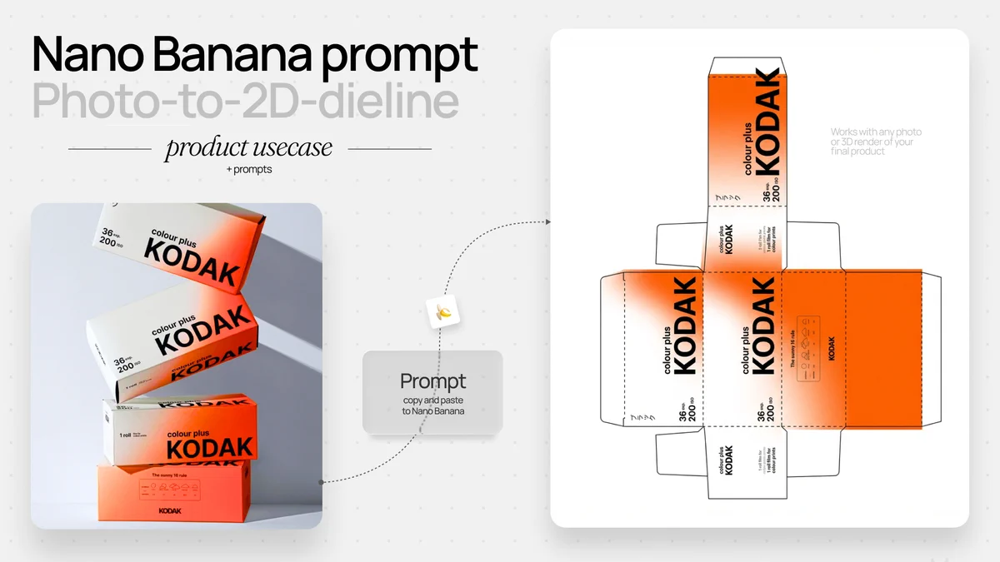</a>

#### 👇 Workflow

`Packaging → unfolded concept`

#### 📝 Full Prompt

```text
Use the uploaded box photograph to visualize a possible unfolded packaging layout. Arrange the visible faces into a connected flat net viewed directly from above. Transfer the visible artwork and lettering to their corresponding panels without stretching them. Use a white canvas, continuous lines for the outer cut boundary, and broken lines for creases.

Treat any unseen flaps or panels as provisional design estimates, leaving unknown artwork blank. Keep panel relationships plausible, but do not invent measurements or claim manufacturing accuracy. Produce a clean concept illustration for discussing packaging structure, not a production cutting file.
```

<sub>Inspired by [@AmirMushich](https://x.com/AmirMushich/status/2003849723837616489) · [Source: X](https://x.com/AmirMushich/status/2003849723837616489) · [Source prompt](https://x.com/AmirMushich/status/2003849730355236967) · Reference-image editing prompt rewritten by SeeAPI; not a verbatim copy; untested · [Author clarification: concept exploration](https://x.com/AmirMushich/status/2003973666078331060) · Earlier inspiration: [Salma Aboukar](https://x.com/Salmaaboukarr/status/1994017531699278056) · Original-post examples; not tests of the rewritten prompt.</sub>

<a id="homes-spaces"></a>

## 🏡 3. Homes & Spaces

<a id="p13-interior-design"></a>

### 3.1. Interior Design

#### 🖼️ Preview

| Before | After |
| :---: | :---: |
| <a href="assets/interior-design/reference-room.png">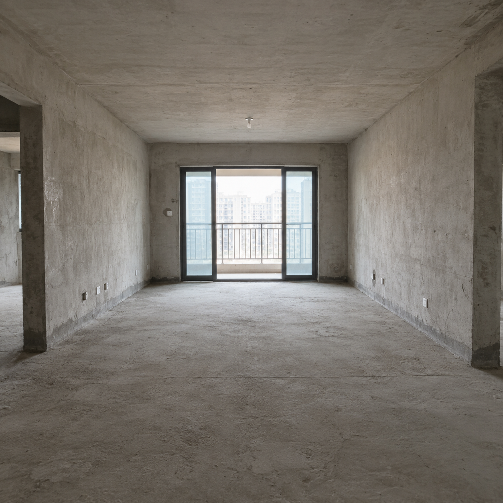</a><br>Room | <a href="assets/interior-design/result-interior.jpg">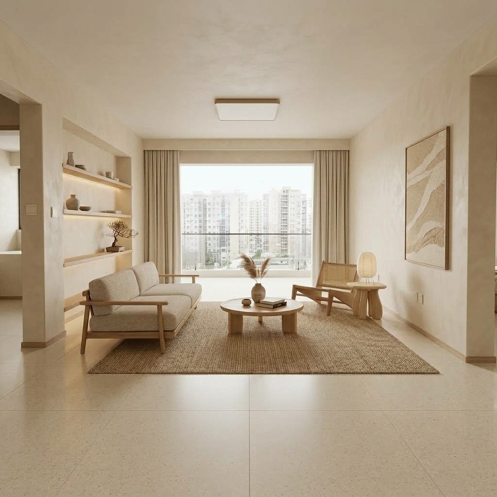</a> |

#### 👇 Workflow

`Room + style → interior redesign`

#### 📝 Full Prompt

```text
Redesign the interior in the uploaded photo in [interior_style]. Preserve the room's actual dimensions, camera viewpoint, ceiling height, walls, windows, doors, and structural features. Develop a cohesive scheme for furniture, lighting, textiles, rugs, and decor that fits the existing space and allows practical circulation.

Use realistic furniture dimensions and coordinated materials and colors. Respect natural light from the existing windows and add plausible lighting fixtures with consistent shadows. Keep doors and walkways unobstructed. Output one photorealistic view from the original camera angle, showing an achievable interior redesign rather than a different room. No floor plan, collage, or added text.
```

<sub>Prompt by SeeAPI</sub>

<a id="p14-landscape-design"></a>

### 3.2. Landscape Design

#### 🖼️ Preview

| Before | After |
| :---: | :---: |
| <a href="assets/landscape-design/reference-yard.png"></a><br>Garden / yard | <a href="assets/landscape-design/result-landscape.jpg">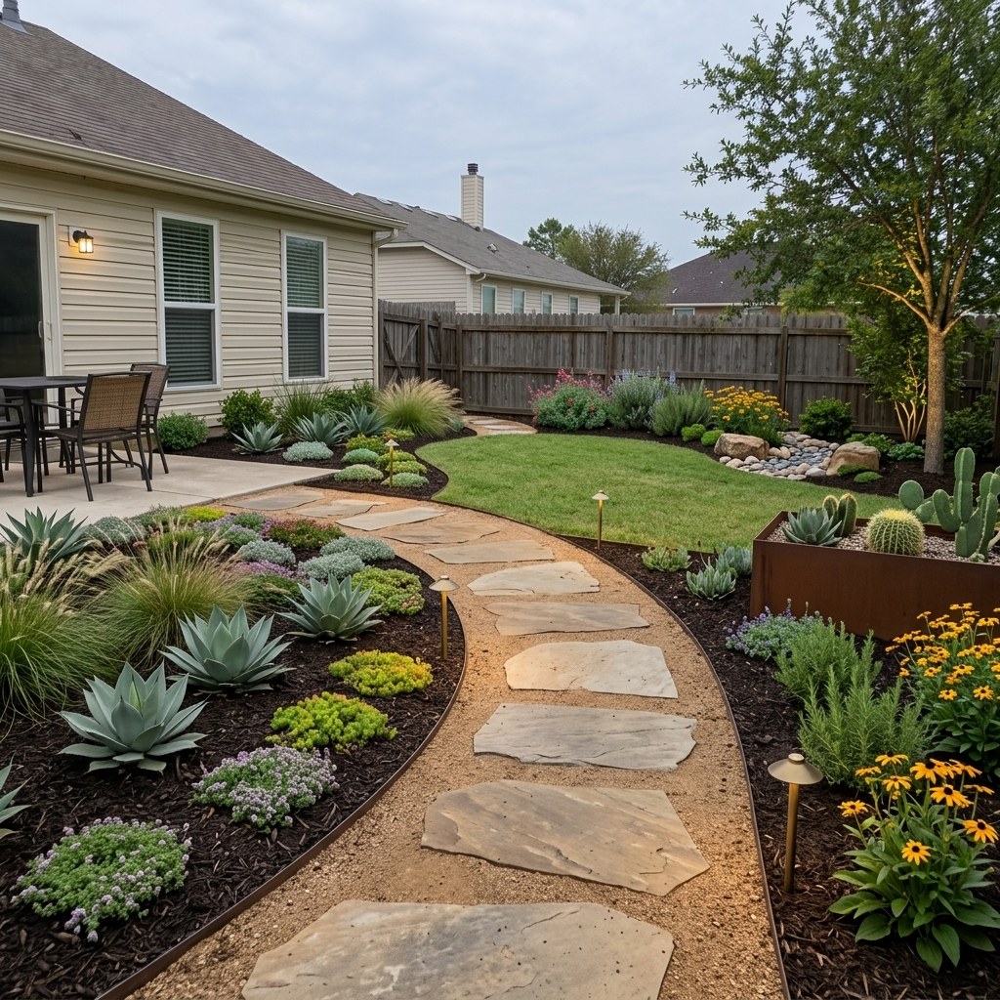</a> |

#### 👇 Workflow

`Yard + style + location → landscape design`

#### 📝 Full Prompt

```text
Redesign the garden or yard in the uploaded image in [landscape_style]. Preserve the existing property boundaries, building footprint, entrances, large structural elements, terrain slope, and camera viewpoint. Arrange planting beds, paths, groundcover, outdoor seating, and subtle landscape lighting into a practical, cohesive design.

Choose a visually compatible planting palette for [climate_or_location], with believable mature plant sizes and spacing. Keep access routes usable and avoid placing plants or furniture through walls or paving. Match the original time of day and create realistic soil, stone, foliage, perspective, and shadows. Output one photorealistic landscape visualization of this same property; no labels or plan overlays.
```

<sub>Prompt by SeeAPI</sub>

<a id="p15-furniture-replacement"></a>

### 3.3. Furniture Replace

#### 🖼️ Preview

**Sofa replacement**

| Before | After |
| :---: | :---: |
| <a href="assets/interior-design/result-interior.jpg"></a> &nbsp; <a href="assets/furniture-replacement/reference-sofa.png"></a><br>Room + sofa | <a href="assets/furniture-replacement/result-sofa.jpg">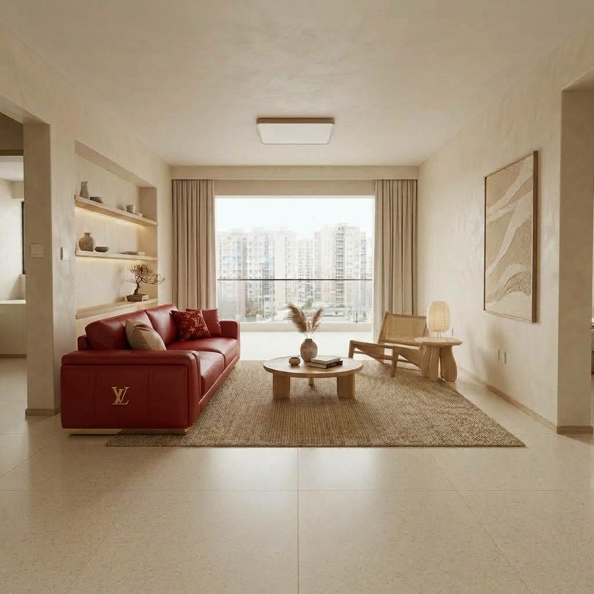</a> |

**Artwork replacement**

| Before | After |
| :---: | :---: |
| <a href="assets/interior-design/result-interior.jpg"></a> &nbsp; <a href="assets/furniture-replacement/reference-artwork.png">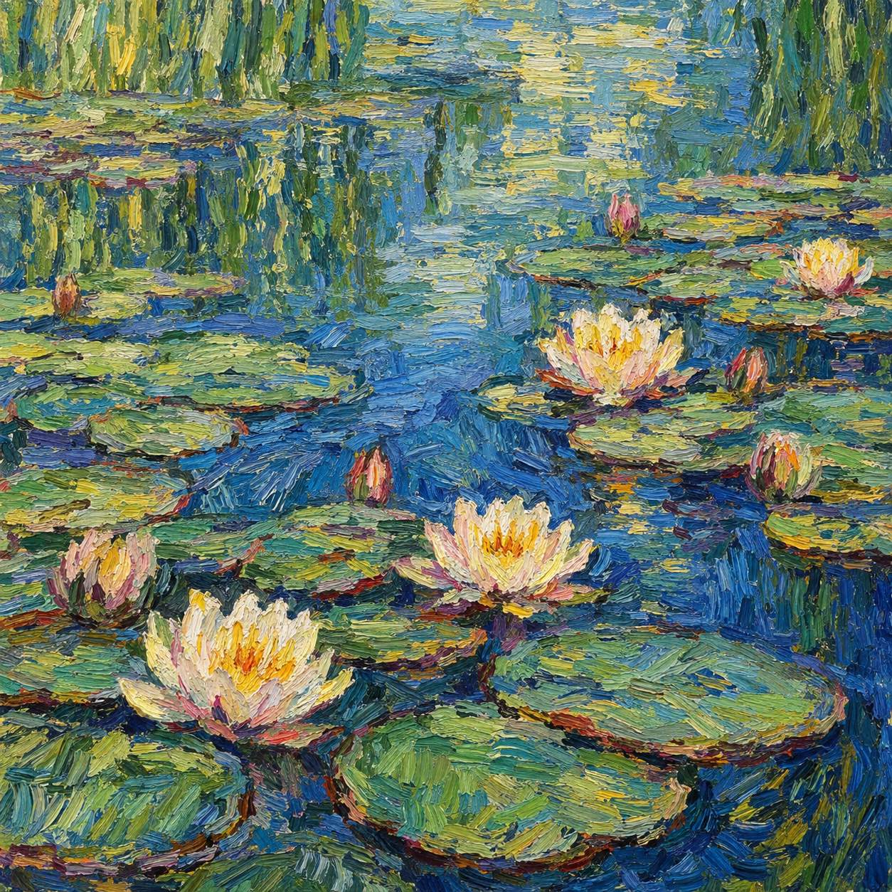</a><br>Room + artwork | <a href="assets/furniture-replacement/result-artwork.jpg">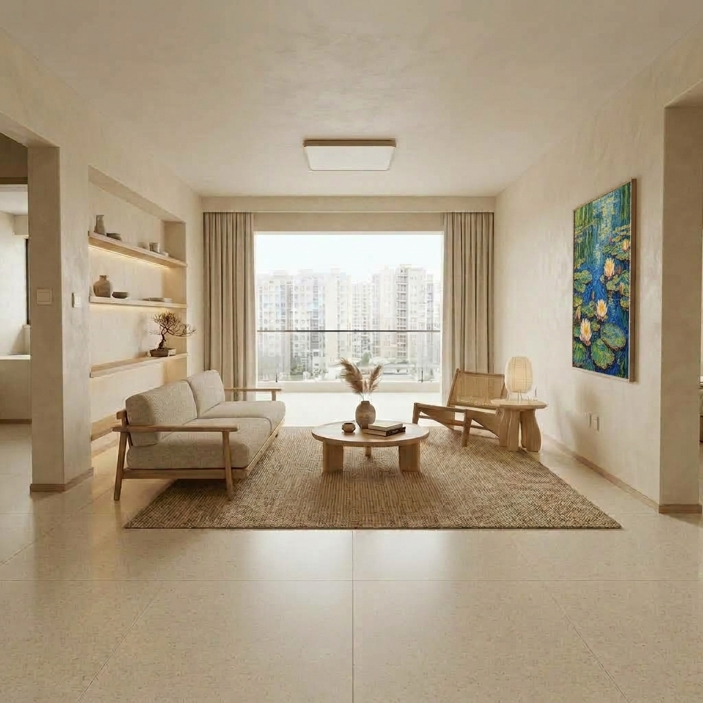</a> |

#### 👇 Workflow

`Room + new furniture / decor → replacement`

#### 📝 Full Prompt

```text
Edit Image 1 by replacing [furniture_to_replace] with [new_furniture_description]. These fields can describe furniture or decorative items, such as a sofa or wall artwork. If additional reference images are supplied, match the selected replacement item’s design, materials, colors, and distinctive details; do not copy its surrounding scene.

Keep the architecture, windows, doors, camera viewpoint, and all unselected furniture and decor unchanged. Fit the replacement naturally into the room with realistic scale, perspective, placement, reflections, and shadows. For wall artwork, preserve the reference composition and fit it to the wall plane. Remove the selected old item cleanly and reconstruct any newly revealed background. Do not redesign the rest of the room. Keep walking routes clear and output one photorealistic edited room image.
```

<sub>Prompt by SeeAPI</sub>

<a id="p16-material-swap"></a>

### 3.4. Custom Material Swap

#### 🖼️ Preview

| Before | After |
| :---: | :---: |
| <a href="assets/material-swap/reference-leather.png">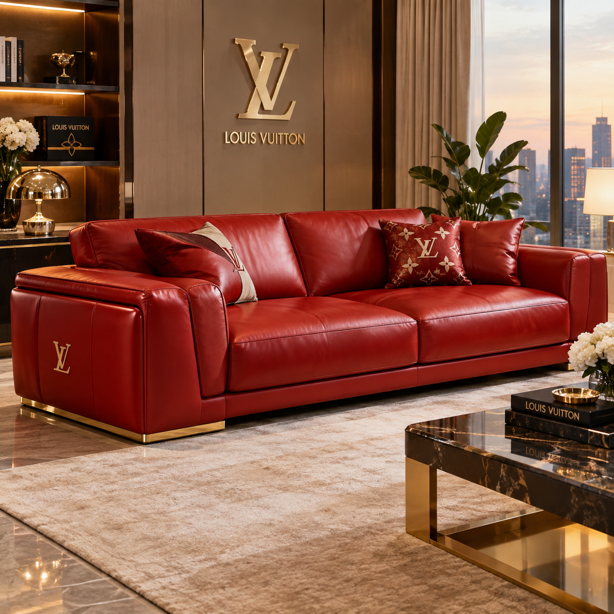</a><br>Object | <a href="assets/material-swap/result-velvet.jpg">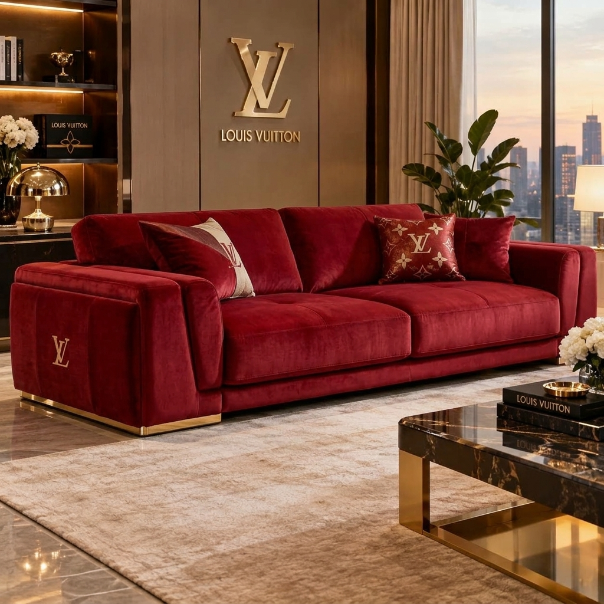</a> |

#### 👇 Workflow

`Object + material → material swap`

#### 📝 Full Prompt

```text
In the uploaded photo, change only the surface material of [target_object] to [material]. Preserve the object's exact shape, dimensions, silhouette, construction, position, and all functional details. Keep the camera, background, surrounding objects, and composition unchanged.

Render the new material with physically believable texture scale, grain direction, roughness, reflectivity, and highlights appropriate to [material]. Wrap the texture naturally around curved surfaces and respect edges, seams, and joints. Match the existing light and update only the reflections and shadows affected by the material change. Do not deform, replace, or recolor unrelated objects. Output one photorealistic edited image.
```

<sub>Prompt by SeeAPI</sub>

<a id="p17-wall-paint"></a>

### 3.5. Custom Wall Paint Color

#### 🖼️ Preview

| Before | After |
| :---: | :---: |
| <a href="assets/wall-paint/reference-room.jpg"></a><br>Room | <a href="assets/wall-paint/result-blue-walls.jpg">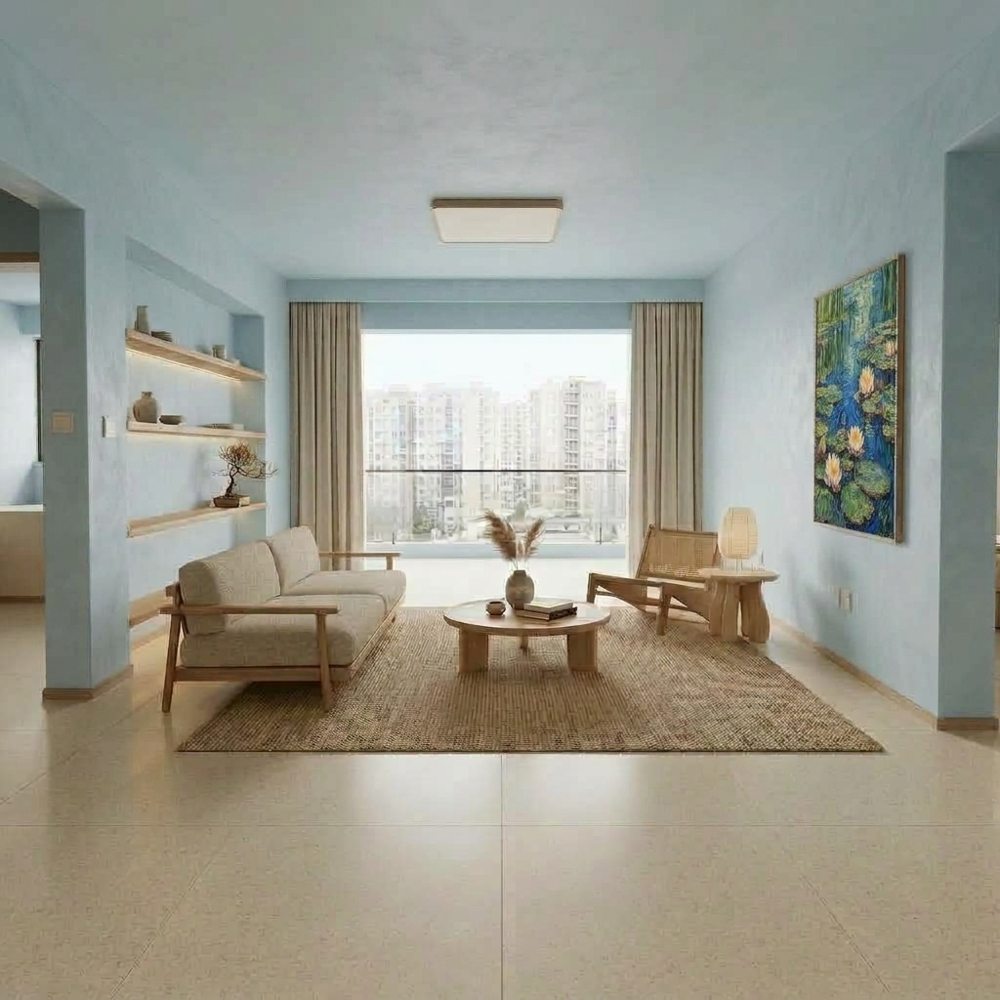</a> |

#### 👇 Workflow

`Wall + paint color → wall recolor`

#### 📝 Full Prompt

```text
Repaint [wall_area] in the uploaded interior photo with [paint_color]. Apply the color only to the selected painted wall surfaces. Keep the ceiling, trim, doors, windows, furniture, artwork, floor, and all other areas unchanged.

Preserve the wall's original texture and architectural details. Show how the chosen paint color naturally appears under the room's existing illumination, including believable highlight and shadow variations rather than a flat color overlay. Keep clean, accurate boundaries around fixtures and objects. Preserve the original framing and perspective and output one photorealistic image of the same room.
```

<sub>Prompt by SeeAPI</sub>

<a id="style-transformations"></a>

## 🎨 4. Style Transformations & Playful Edits

<a id="p18-polaroid"></a>

### 4.1. Polaroid Photo

#### 🖼️ Preview

| Before | After |
| :---: | :---: |
| <a href="assets/portraits/result-group-photo-updated.jpg"></a><br>Photo | <a href="assets/polaroid/result-polaroid.png">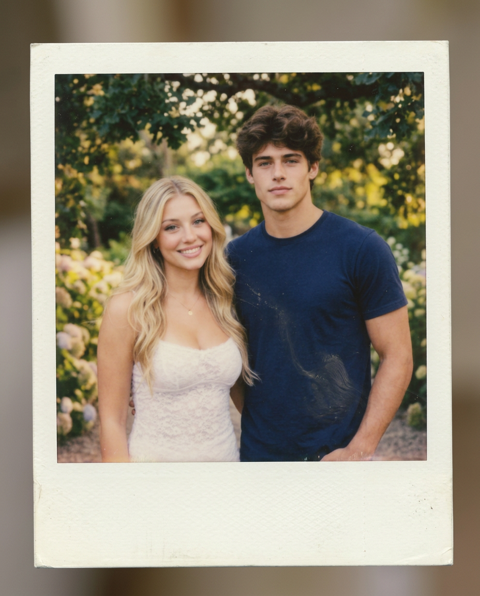</a> |

#### 👇 Workflow

`Photo → Polaroid look`

#### 📝 Full Prompt

```text
Transform the uploaded image into a believable vintage Polaroid instant photograph. Preserve the identities, expressions, subject arrangement, and main scene. Apply soft direct-flash illumination, gently muted colors, warm highlights, slightly faded shadows, subtle film grain, mild lens softness, and natural instant-film imperfections without obscuring faces.

Present the image inside a clean off-white instant-photo border with a slightly deeper bottom margin. Fit the full main subject within the photo area; do not crop out important features. Keep the effect restrained and photographic. Do not add handwriting, dates, captions, extra people, or heavy damage.
```

<sub>Prompt by SeeAPI</sub>

<a id="p19-lego-style"></a>

### 4.2. LEGO Brick World

#### 🖼️ Preview

| Before | After |
| :---: | :---: |
| <a href="assets/portraits/reference-cat.png"></a><br>Photo | <a href="assets/lego-style/result-lego.jpg">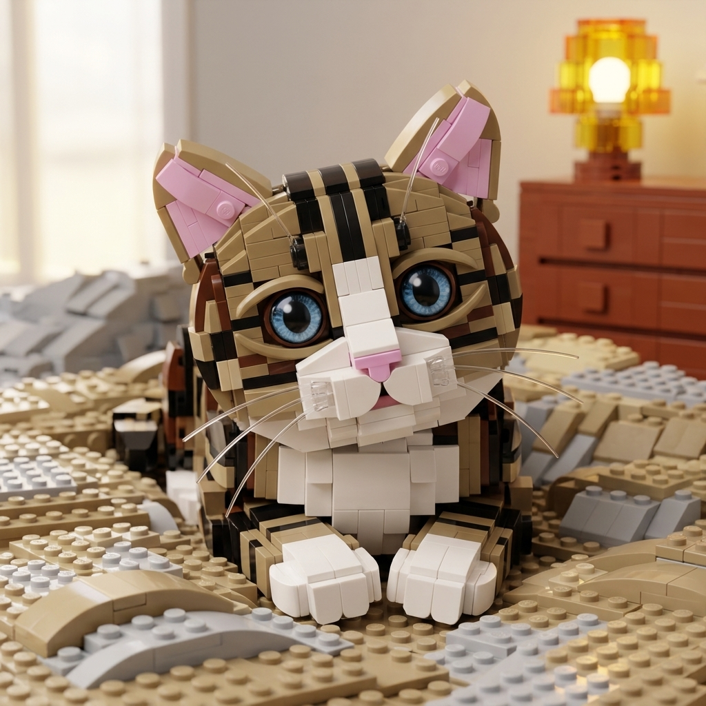</a> |

#### 👇 Workflow

`Photo → LEGO world`

#### 📝 Full Prompt

```text
Rebuild the uploaded scene as a detailed LEGO-style brick diorama. Preserve the original composition, camera angle, subject positions, recognizable clothing colors, and key background elements. Convert people into expressive minifigures with recognizable hairstyles and accessories; construct the environment and objects from plausible interlocking plastic bricks, plates, tiles, and studs.

Use coherent brick scale, clean joins, subtle molded-plastic texture, and realistic miniature lighting. Recreate the original scene's mood and light direction with soft depth of field while keeping the main subjects clear. Everything visible should belong to the same brick-built world. Output one finished diorama photograph, with no added captions or packaging.
```

<sub>Prompt by SeeAPI</sub>

<a id="p20-ghibli-anime"></a>

### 4.3. Ghibli Anime

#### 🖼️ Preview

| Before | After |
| :---: | :---: |
| <a href="assets/portraits/result-pet-selfie.jpg"></a><br>Photo | <a href="assets/ghibli-anime/result-anime.jpg">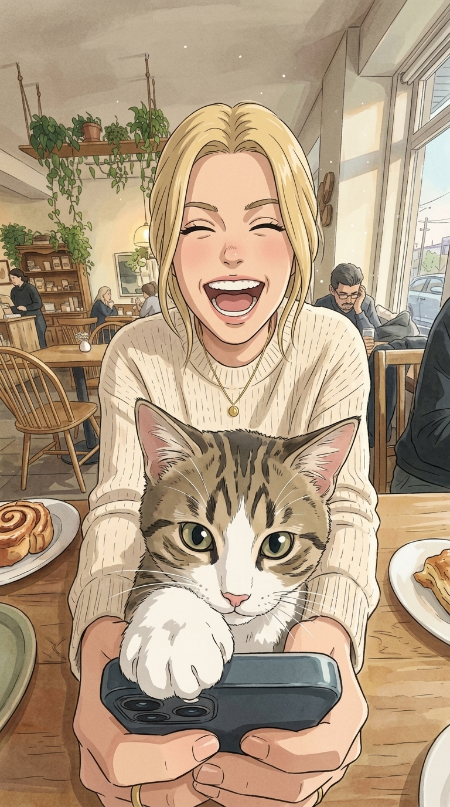</a> |

#### 👇 Workflow

`Photo → Ghibli anime`

#### 📝 Full Prompt

```text
Reinterpret the uploaded image as a Studio Ghibli-inspired hand-drawn anime scene. Preserve the recognizable identities, expressions, pose, composition, and relationships between the subjects. Use delicate expressive linework, softly painted watercolor-like backgrounds, gentle cel shading, warm natural colors, and atmospheric light.

Translate real details into a cohesive illustrated world with lush, carefully observed surroundings and a calm, heartfelt everyday mood. Keep the main facial features recognizable without making everyone look identical. Preserve the original setting rather than introducing existing film characters or replacing the scene. Output one complete illustration with no captions, logos, or borders.
```

<sub>Prompt by SeeAPI</sub>

<a id="p21-miniature-figurine"></a>

### 4.4. Collectible Miniature Figurine

#### 🖼️ Preview

| Before | After |
| :---: | :---: |
| <a href="assets/miniature-figurine/reference-toy.png">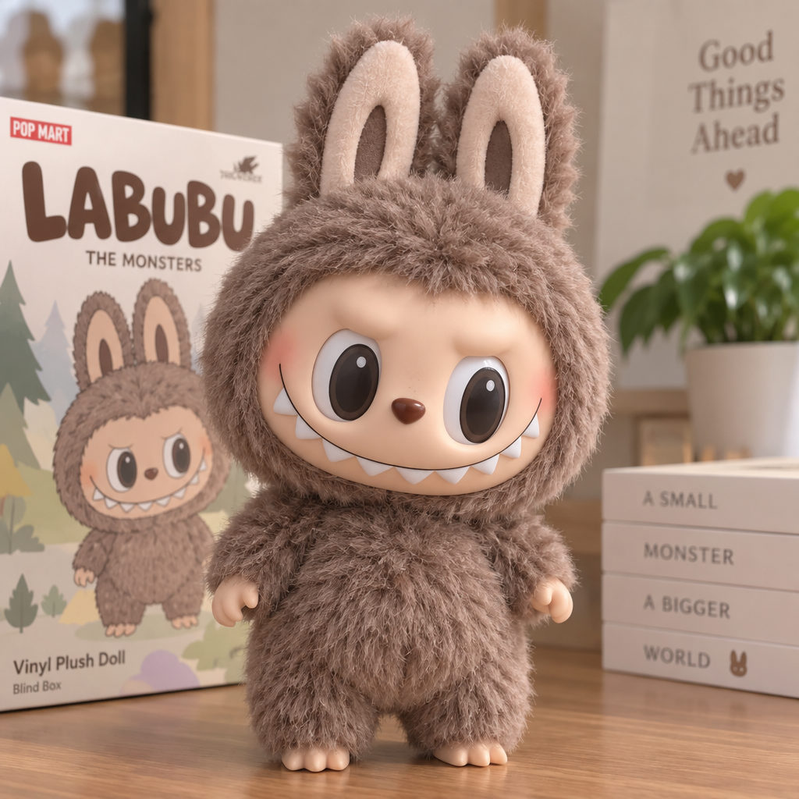</a><br>Portrait / character | <a href="assets/miniature-figurine/result-figurine.jpg">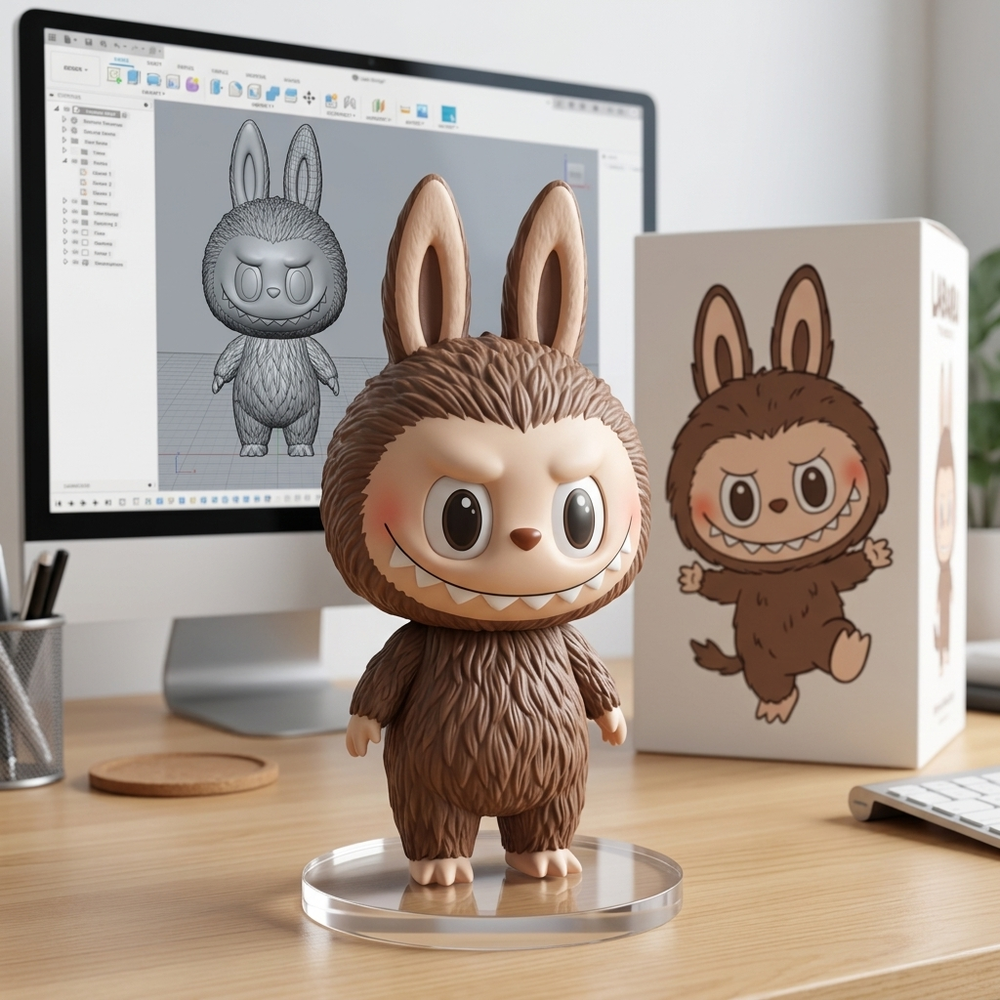</a> |

#### 👇 Workflow

`Character → collectible figurine`

#### 📝 Full Prompt

```text
Create a photorealistic product photograph of a 1/7-scale collectible figurine based on the person or character in the uploaded image. Preserve their recognizable face, hairstyle, outfit, pose, and accessories, translated into a finely sculpted painted resin figure. Give the figure believable miniature proportions and detailed fabric folds, hair strands, and material finishes.

Place the full figurine on a clear round acrylic base on a tidy desk. Behind it, show a computer monitor displaying a gray 3D sculpt of the same figure and an upright collectible box decorated with a flat illustration of the same character. Keep the figure as the sharp focal point, with the background softly out of focus. Use natural desk-side light, realistic scale, and subtle resin reflections. No brand logos or readable text on the box, screen, or base. Output a single photograph.
```

<sub>Prompt by SeeAPI</sub>

<a id="p22-oil-painting"></a>

### 4.5. Oil Painting

#### 🖼️ Preview

| Before | After |
| :---: | :---: |
| <a href="assets/landscape-design/reference-yard.png"></a><br>Photo | <a href="assets/oil-painting/result-oil-painting.jpg"></a> |

#### 👇 Workflow

`Photo → oil painting`

#### 📝 Full Prompt

```text
Convert the uploaded image into a traditional hand-painted oil painting. Preserve the original subject and composition, but reinterpret the entire image with thick, expressive brushstrokes, layered oil pigments, subtle impasto texture, visible canvas grain, rich color depth, and painterly highlights and shadows. Use soft edge transitions and natural tonal variation to create the appearance of an authentic physical painting. Detailed, artistic, timeless fine art aesthetic, realistic proportions, harmonious colors, gallery-quality oil painting.
```

<sub>User-supplied prompt · Original author and source pending</sub>

<a id="p28-colorful-yarn-embroidery"></a>

### 4.6. Colorful Yarn Embroidery

#### 🖼️ Preview

| Before ↓ After | Before ↓ After |
| :---: | :---: |
| <a href="assets/colorful-yarn-embroidery/source-example-01.webp"></a> | <a href="assets/colorful-yarn-embroidery/source-example-02.webp"></a> |
| <a href="assets/colorful-yarn-embroidery/source-example-03.webp"></a> | <a href="assets/colorful-yarn-embroidery/source-example-04.webp"></a> |

#### 👇 Workflow

`Photo → colorful embroidery`

#### 📝 Full Prompt

```text
Create a vertical comparison from the uploaded photo: the original above, a colorful yarn-embroidery reinterpretation below. Give both halves the same dimensions; keep the upper image unchanged and avoid borders or labels.

Rebuild the lower scene as a tactile handmade patch on ivory woven cloth. Use chunky stitched contours, looped yarn, layered thread, and small relief shadows. Retain the people, poses, clothing colors, distinctive objects, and main action; simplify background clutter. Faces turned away must remain turned away. Every illustrated element should look sewn, not printed. Photograph the needlework straight on under gentle studio light.

Beneath the stitched scene, embroider three centered lines: [TITLE], [EDITION], and [CAPTION]. Use bold raised lettering for the title and smaller stitching below. Reproduce supplied text exactly. For omitted fields, invent a short English title and warm caption; use PATCH NO. 01 as the default edition. Never print placeholder brackets. Return only the completed comparison.
```

<sub>Inspired by [@ai_suxiaole](https://x.com/ai_suxiaole/status/2099824477173690831) · [Source: X](https://x.com/ai_suxiaole/status/2099824477173690831) · [Source prompt](https://x.com/ai_suxiaole/status/2099824480772374956) · Reference-image editing prompt rewritten by SeeAPI; not a verbatim copy; untested · Original-post examples; not tests of the rewritten prompt.</sub>

<a id="restoration-adjustments"></a>

## 🪄 5. Photo Restoration & Local Adjustments

<a id="p23-old-photo-restoration"></a>

### 5.1. Old Photo Restoration

#### 🖼️ Preview

Original post example

| Before | After |
| :---: | :---: |
| <a href="assets/old-photo-restoration/source-example-01.webp">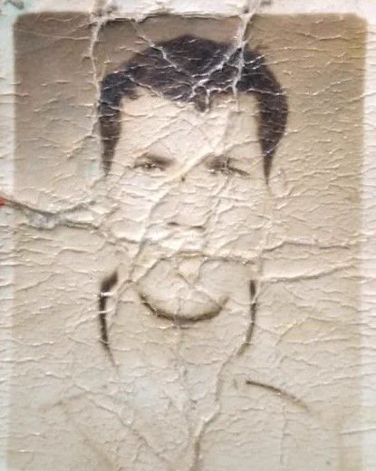</a><br>Old photo | <a href="assets/old-photo-restoration/source-example-02.webp">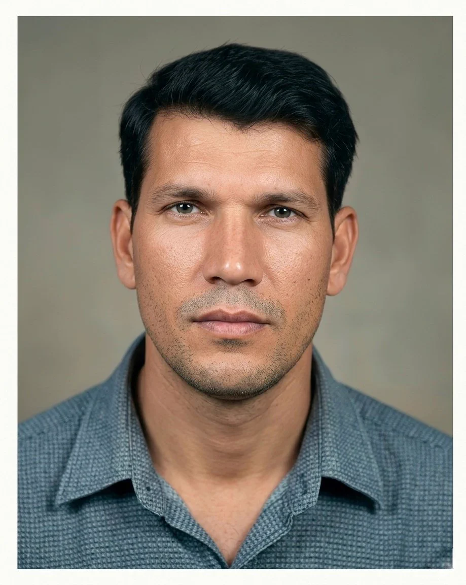</a> |

#### 👇 Workflow

`Old photo → restored photo`

#### 📝 Full Prompt

```text
Restore the uploaded old photograph carefully. Remove scratches, dust, stains, creases, and scanning artifacts. Repair small damaged areas using the surrounding visual evidence, improve faded contrast, and recover natural detail without excessive sharpening or invented facial features.

Preserve the original identities, age, expressions, clothing, background, composition, and historical character. Keep monochrome photos monochrome and retain the original palette of color photos. Preserve fine photographic grain and natural skin texture; do not modernize clothing, add objects, or apply beauty retouching. Where detail is irretrievably missing, use restrained reconstruction rather than fabricated certainty. Output one clean, faithful restoration with the original framing.
```

<sub>Prompt by SeeAPI · Images: [@Noor_ul_ain43 · X](https://x.com/Noor_ul_ain43/status/2030189593644126420); source-post examples, not verified outputs of the prompt below</sub>

<a id="p24-add-text"></a>

### 5.2. Add Text to Image

#### 🖼️ Preview

| Before | After |
| :---: | :---: |
| <a href="assets/add-text/before.jpg">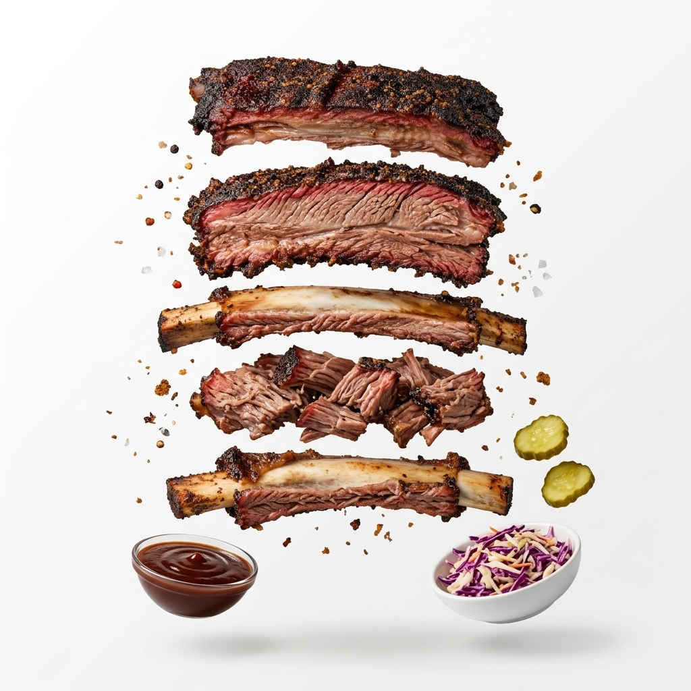</a><br>Photo | <a href="assets/add-text/after.png">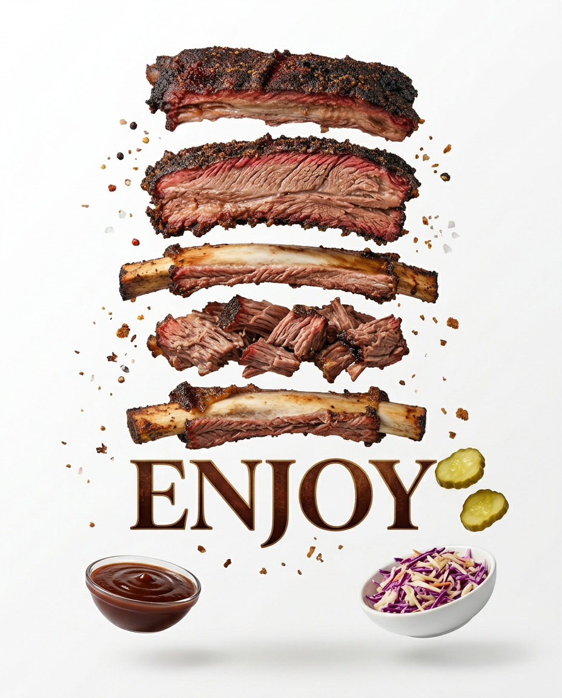</a> |

#### 👇 Workflow

`Photo + text + placement → text overlay`

#### 📝 Full Prompt

```text
Add the exact text "[text_content]" to [text_location] in the uploaded image, using [text_style]. Reproduce the supplied wording, capitalization, punctuation, and line breaks exactly; do not translate, paraphrase, add, or omit characters.

Make the text clearly legible and aesthetically balanced at the intended size. If applied to a physical surface, match its perspective, curvature, texture, lighting, and occlusion. If intended as a graphic overlay, use clean typography and suitable contrast. Preserve the rest of the image, including faces and existing unrelated text. Do not cover important subjects unless the specified location requires it. Output one edited image without extra captions.
```

<sub>Prompt by SeeAPI</sub>

<a id="p25-remove-object"></a>

### 5.3. Remove Unwanted Objects

#### 🖼️ Preview

| Before | After |
| :---: | :---: |
| <a href="assets/remove-object/before.png">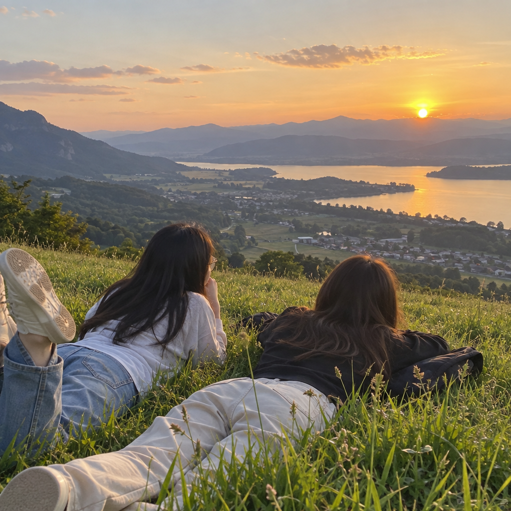</a><br>Photo | <a href="assets/remove-object/after.png">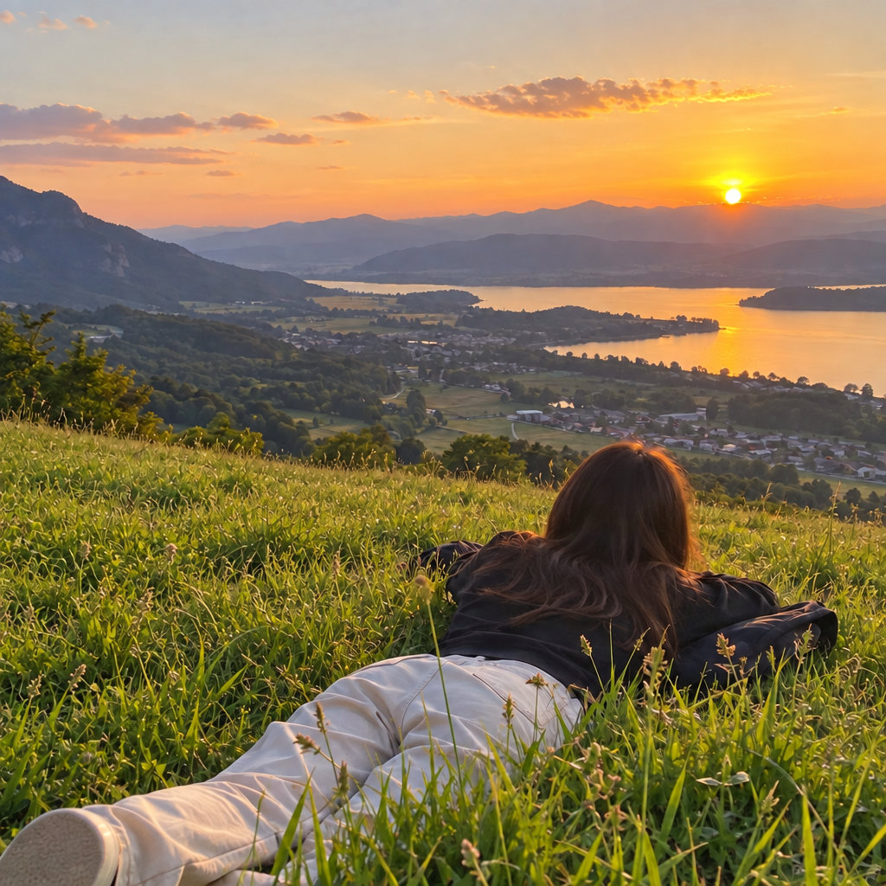</a> |

#### 👇 Workflow

`Photo + target object → object removal`

#### 📝 Full Prompt

```text
Remove [object_to_remove] from the uploaded image, including its associated cast shadow and reflection only where they belong to that object. Reconstruct the revealed background seamlessly using the surrounding scene's texture, geometry, perspective, lighting, and depth of field.

Preserve every other person, object, edge, and architectural feature. Do not replace the removed object with anything new, shift nearby subjects, crop the image, or alter overall colors. Avoid smears, repeating texture patterns, blurred patches, and visible edit boundaries. Output one natural-looking image with the original dimensions and framing.
```

<sub>Prompt by SeeAPI</sub>

<a id="p26-relight-image"></a>

### 5.4. Relight Image

#### 🖼️ Preview

| Before | After |
| :---: | :---: |
| <a href="assets/relight-image/before.png"></a><br>Photo | <a href="assets/relight-image/after.jpg"></a> |

#### 👇 Workflow

`Photo + lighting → relit image`

#### 📝 Full Prompt

```text
Relight the uploaded image with [lighting_description]. Keep all subjects, identities, poses, object shapes, materials, camera perspective, and composition unchanged. Modify the illumination rather than redesigning the scene.

Apply a coherent light direction, source size, color temperature, intensity, and falloff. Update highlights, shadows, catchlights, reflections, and contact shadows consistently across the scene, including subtle bounced light where appropriate. Preserve natural skin tones and material detail; avoid clipped highlights, crushed shadows, fake halos, or a flat color filter. Output one photorealistic image with the requested lighting and no added visible light fixtures unless specified.
```

<sub>Prompt by SeeAPI</sub>

<a id="license"></a>

## 📄 License

SeeAPI’s original prompts and documentation are licensed under [CC BY 4.0](https://creativecommons.org/licenses/by/4.0/). You may copy, share, and adapt them, including commercially. Credit **SeeAPI**, link to [this repository](https://github.com/SeeAPI/nano-banana-prompts-for-image-editing) and the license, and indicate any changes.

Third-party prompts and images remain subject to their original owners’ terms; attribution alone does not grant permission to reuse them. See [LICENSE.md](LICENSE.md).
