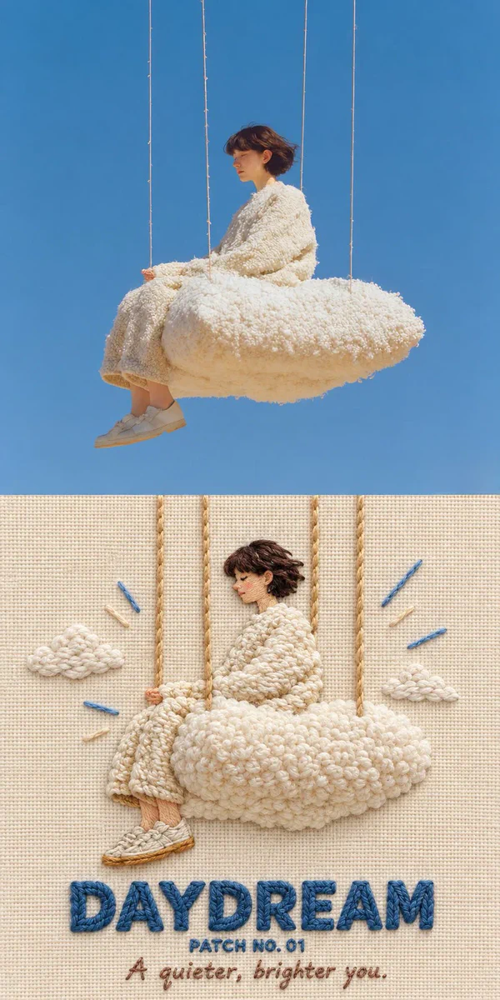
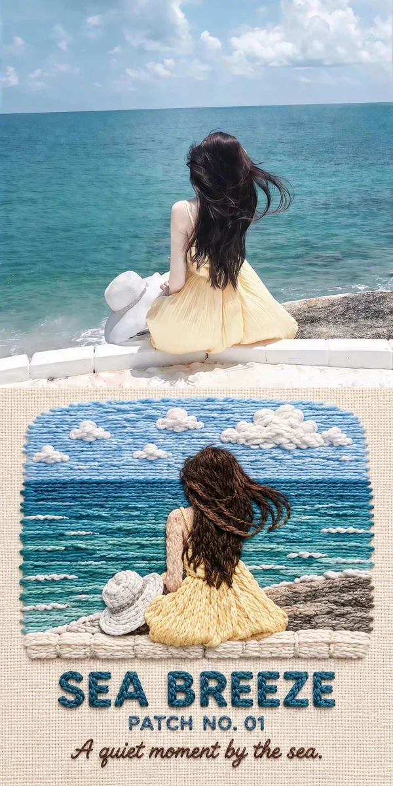
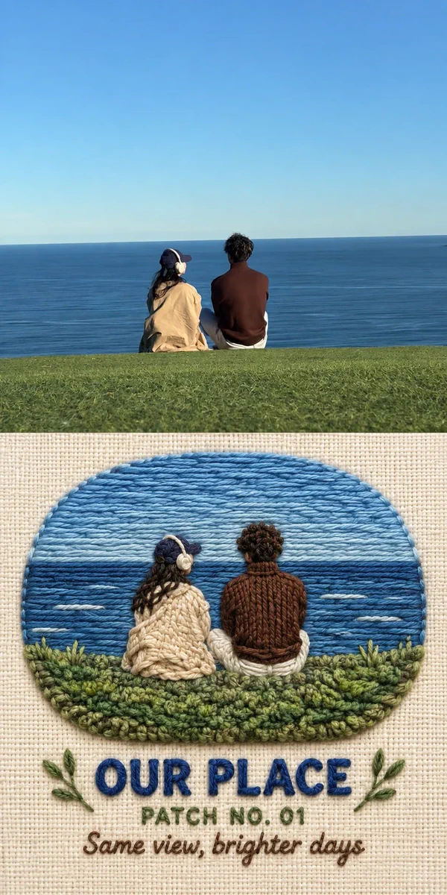
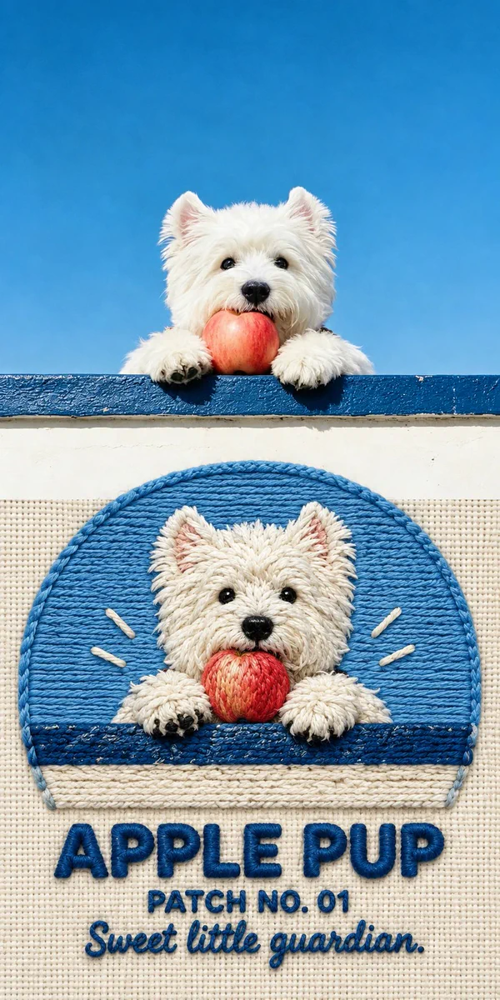

# P28 · Colorful Yarn Embroidery

## 🖼️ Preview

| Before ↓ After | Before ↓ After |
| :---: | :---: |
| <a href="../assets/colorful-yarn-embroidery/source-example-01.webp"></a> | <a href="../assets/colorful-yarn-embroidery/source-example-02.webp"></a> |
| <a href="../assets/colorful-yarn-embroidery/source-example-03.webp"></a> | <a href="../assets/colorful-yarn-embroidery/source-example-04.webp"></a> |

## 👇 Workflow

`Photo → colorful embroidery`

## 📝 Full Prompt

```text
Create a vertical comparison from the uploaded photo: the original above, a colorful yarn-embroidery reinterpretation below. Give both halves the same dimensions; keep the upper image unchanged and avoid borders or labels.

Rebuild the lower scene as a tactile handmade patch on ivory woven cloth. Use chunky stitched contours, looped yarn, layered thread, and small relief shadows. Retain the people, poses, clothing colors, distinctive objects, and main action; simplify background clutter. Faces turned away must remain turned away. Every illustrated element should look sewn, not printed. Photograph the needlework straight on under gentle studio light.

Beneath the stitched scene, embroider three centered lines: [TITLE], [EDITION], and [CAPTION]. Use bold raised lettering for the title and smaller stitching below. Reproduce supplied text exactly. For omitted fields, invent a short English title and warm caption; use PATCH NO. 01 as the default edition. Never print placeholder brackets. Return only the completed comparison.
```

<sub>Inspired by [@ai_suxiaole](https://x.com/ai_suxiaole/status/2099824477173690831) · [Source: X](https://x.com/ai_suxiaole/status/2099824477173690831) · [Source prompt](https://x.com/ai_suxiaole/status/2099824480772374956) · Reference-image editing prompt rewritten by SeeAPI; not a verbatim copy; untested · Original-post examples; not tests of the rewritten prompt.</sub>
