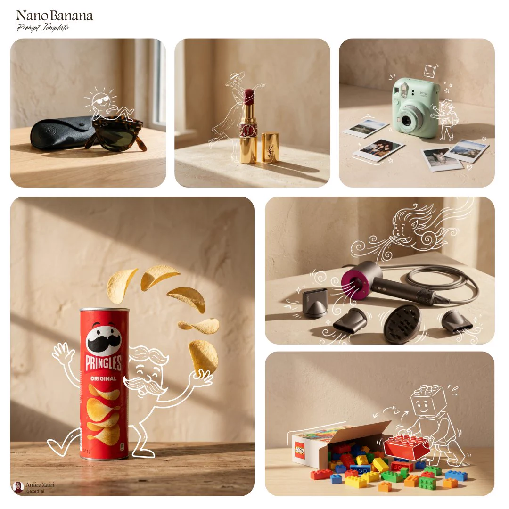

# P11 · Doodle Product Advertisement

## 🖼️ Preview

Original post example

<a href="../assets/doodle-product-ad/source-example-01.webp"></a>

## 👇 Workflow

`Product + doodle idea → creative ad`

## 📝 Full Prompt

```text
Recompose the product in the uploaded photograph into [product setup] on a simple tabletop beside a warm beige plaster wall. Preserve the package shape, materials, colors, and branding. Let angled window light produce elongated shadows and a calm editorial atmosphere.

Draw a playful [character] with thin white sketch lines so it appears to interact with the actual product: leaning on it, carrying it, or peeking around it where the composition allows. Keep the product photographic and the character clearly hand drawn. Do not obscure the label. Use a square composition with breathing room, restrained props, and no additional words.
```

<sub>Inspired by [@azed_ai](https://x.com/azed_ai/status/2053142448533377048) · [Source: X](https://x.com/azed_ai/status/2053142448533377048) · [Source prompt](https://x.com/azed_ai/status/2053142472222802430) · Reference-image editing prompt rewritten by SeeAPI; not a verbatim copy; untested · Original-post examples; not tests of the rewritten prompt.</sub>
