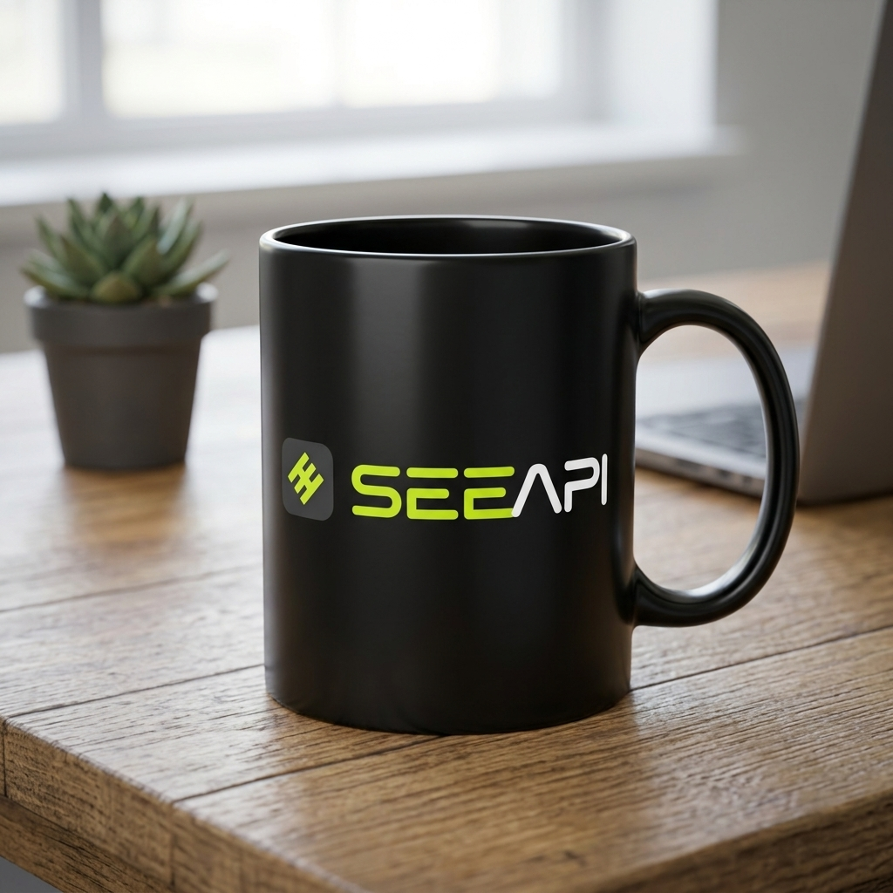
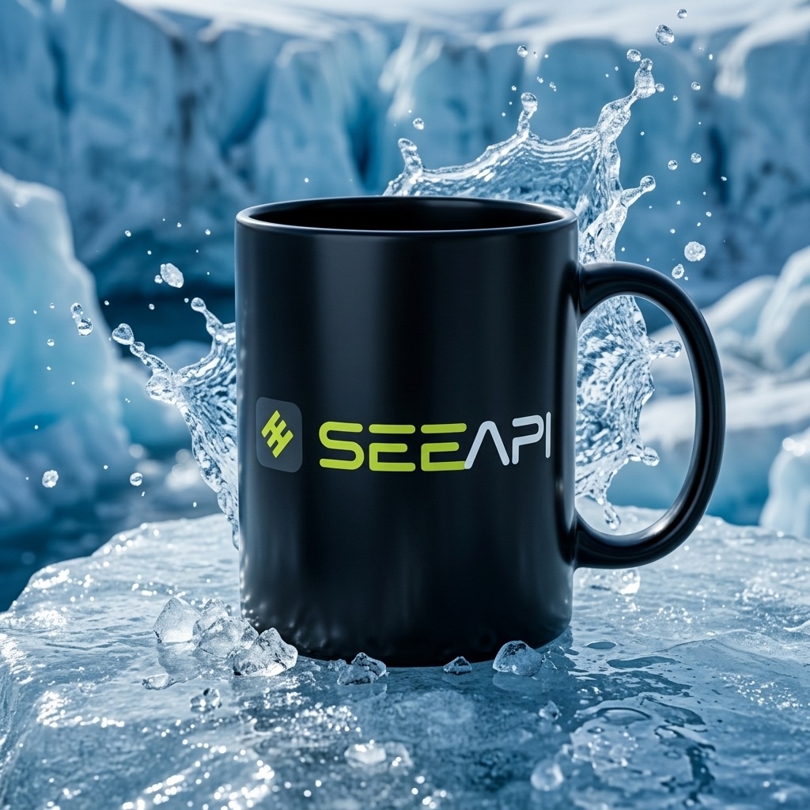

# P02 · Product Background Replacement

## 🖼️ Preview

| Before | After |
| :---: | :---: |
| <a href="../assets/products/reference-seeapi-mug.jpg"></a><br>Product | <a href="../assets/products/result-mug-ice-background.jpg"></a> |

## 👇 Workflow

`Product + background description → new scene`

## 📝 Full Prompt

```text
Edit the uploaded product photo. Replace the background with [background_description]. Keep the product's exact silhouette, proportions, color, material, logo, label text, and packaging details unchanged. Do not redesign or duplicate it.

Integrate the product naturally into the new setting with a believable scale, perspective, surface contact, and matching light direction, reflections, and shadows. Keep the product clearly visible and in sharp focus; use background depth of field only where appropriate. Produce one polished commercial photograph without adding text, decorative logos, or unrelated products.
```

<sub>Prompt by SeeAPI</sub>
