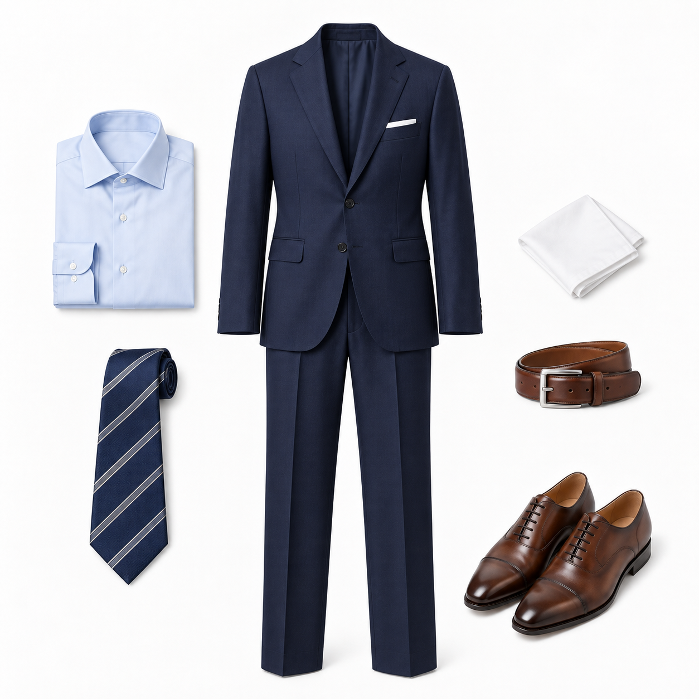
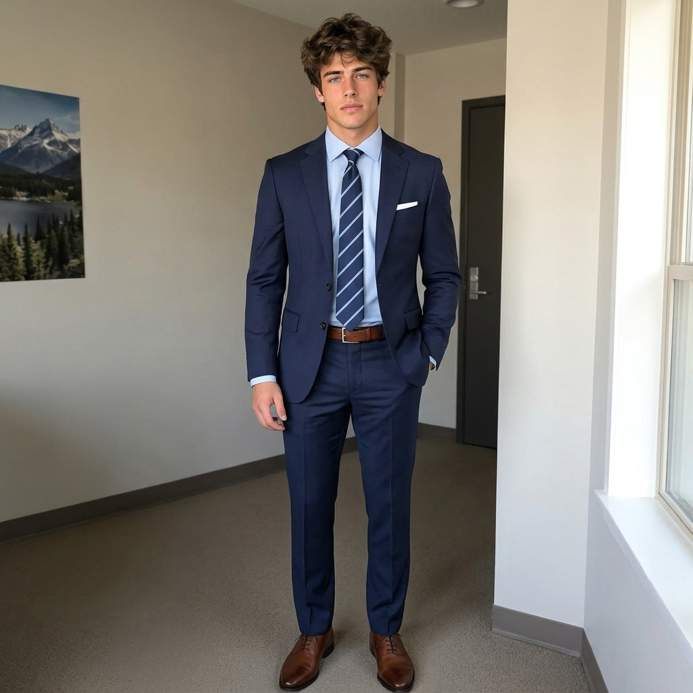

# P01 · 虚拟试衣

## 🖼️ 预览

| Before | After |
| :---: | :---: |
| <a href="../../assets/portraits/reference-man.png"></a> &nbsp; <a href="../../assets/portraits/reference-outfit.png"></a><br>人物 + 穿搭 | <a href="../../assets/portraits/result-virtual-try-on.jpg"></a> |

## 👇 工作流

`人物 + 穿搭 → 虚拟试衣`

## 📝 完整提示词

```text
根据图 2 及其他参考图中的全部服装与配饰，编辑图 1。让人物穿上完整参考造型，包括参考图提供的上装、下装或连衣裙、外套、鞋子、包袋、首饰、眼镜、腰带和帽饰。转移所有可见穿搭单品，不遗漏小配饰，也不凭空添加单品。保留每件单品的颜色、材质、图案、形状和可辨识设计细节。

保持人物的脸部、身份、发型、肤色、体型与身体比例不变。让衣服自然合身、层次合理，呈现真实的面料垂坠、开合结构、接触阴影及恰当的配饰位置。左右鞋子保持一致。匹配原场景的透视、光照和色温。尽量保留原姿势与背景；如果原图裁掉了脚部，自然扩展画面以展示完整造型。输出一张协调统一、照片级真实的全身时尚照片，不要拼贴、添加文字或重复肢体。
```

<sub>提示词：SeeAPI</sub>
