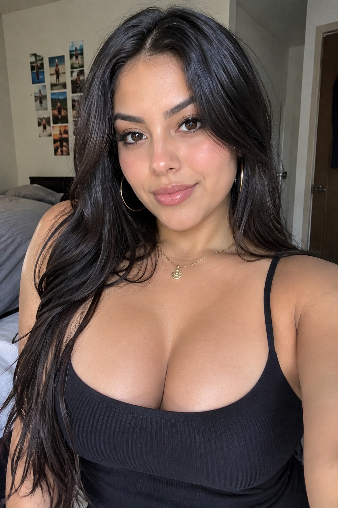
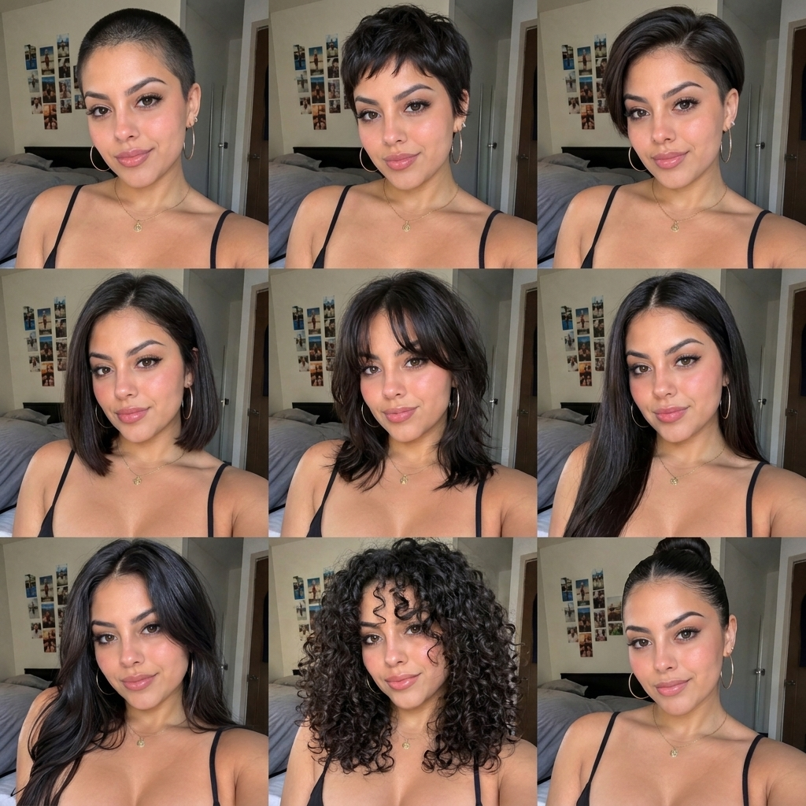

# P06 · 3 × 3 发型九宫格

## 🖼️ 预览

| Before | After |
| :---: | :---: |
| <a href="../../assets/portraits/reference-hairstyle.png"></a><br>正面人像 | <a href="../../assets/portraits/result-hairstyle-grid.jpg"></a> |

## 👇 工作流

`上传清晰正面人像 → 输入提示词 → 生成同一张脸、九种不同发型的 3 × 3 九宫格`

## 📝 完整提示词

```text
根据上传的人像，生成一张干净的 3 × 3 九宫格，恰好包含九个大小相同的同一人物头肩肖像。每格都保留完全一致的面部身份、脸型、年龄、肤色、表情、已有面部毛发、服装、相机角度、背景和光照。只改变头发造型，九格保持原有发色一致。

按从左到右、从上到下的顺序呈现九种明显不同的发型：(1) 贴头寸发；(2) 有纹理的精灵短发；(3) 侧分短发配两侧铲短；(4) 齐下巴的一刀切波波头；(5) 带八字刘海的齐肩层次发；(6) 中分长直发；(7) 侧分长款大波浪；(8) 蓬松紧密卷发；(9) 发际线整洁的光滑高丸子头。让每款发型真实适配此人的头型和面部，不改变身份或性别呈现。这些发型适用于任何性别，不要将脸部男性化或女性化。

每格完整展示头发，保持一致取景和窄而均匀的间隔。九种发型必须清晰不同，不重复发型、不缺格、不增加面孔、标签或水印。
```

<sub>提示词：SeeAPI</sub>
