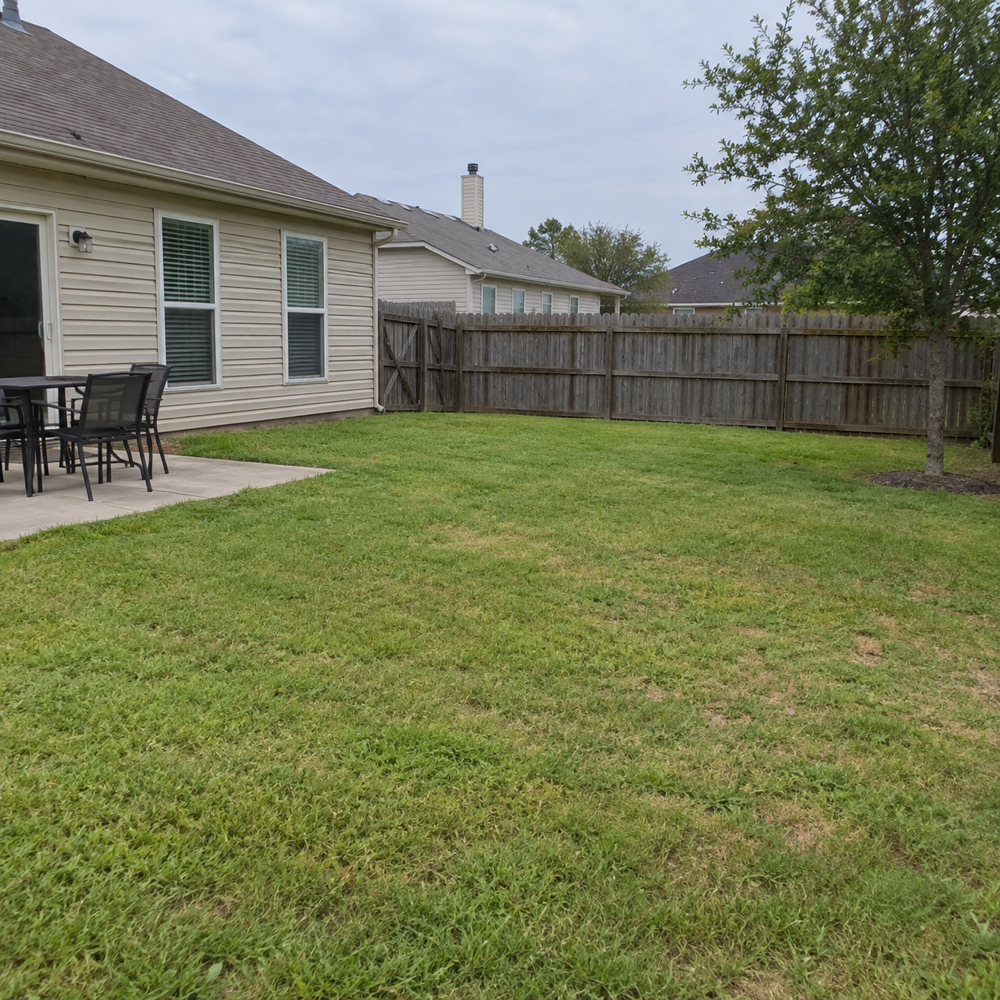
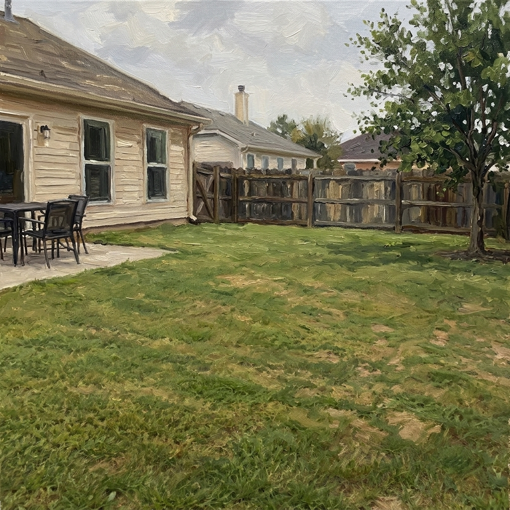

# P22 · 油画风格

## 🖼️ 预览

| Before | After |
| :---: | :---: |
| <a href="../../assets/landscape-design/reference-yard.png"></a><br>原图 | <a href="../../assets/oil-painting/result-oil-painting.jpg"></a> |

## 👇 工作流

`原图 → 油画`

## 📝 完整提示词

```text
将上传图片转换为画布上纹理丰富的油画。保留主要主体的身份、表情、比例、姿势、构图及重要场景细节。用明确可见的笔触、叠加颜料、轻微厚涂高光和协调的绘画色彩来表现形体。

通过合理光影保持空间深度，把细碎摄影噪点简化为富有表现力的笔触。让面孔和关键物体保持可辨认，不扭曲特征，也不要只在照片上叠加均匀的数字纹理。让画作本身铺满画面，不添加画框、签名、标签或画廊场景。
```

<sub>提示词：SeeAPI</sub>
