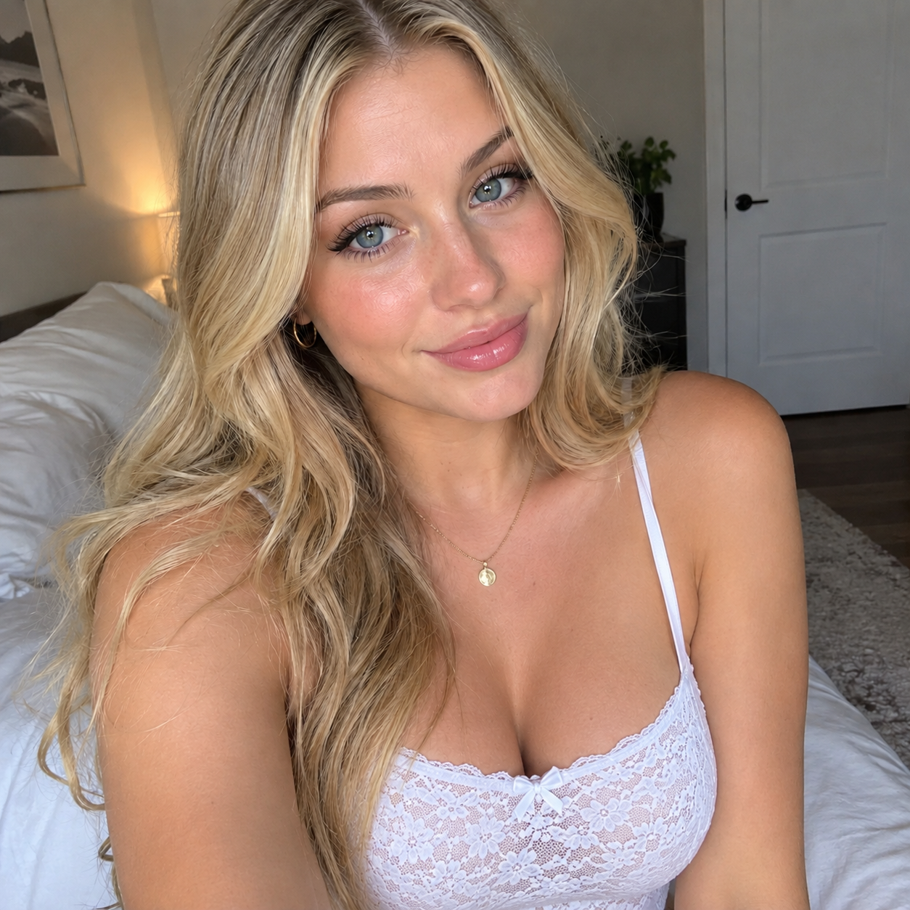
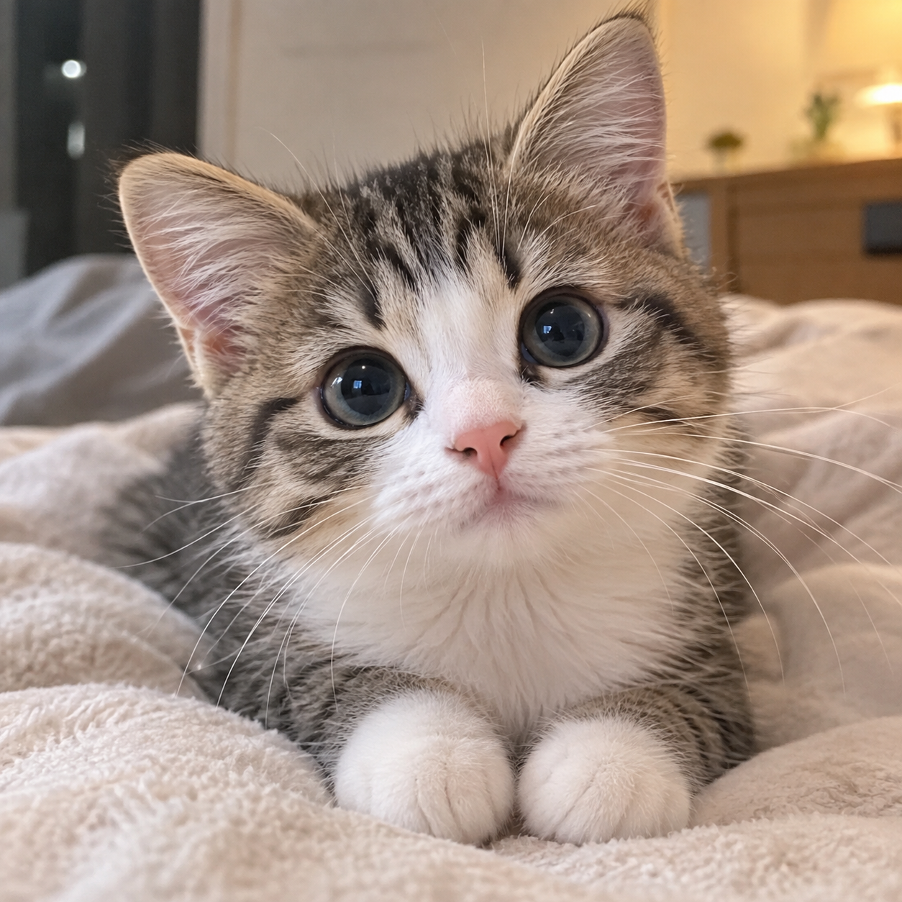
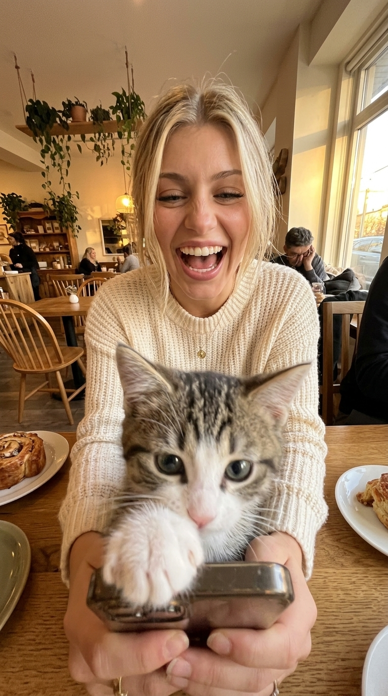

# P05 · 和宠物的搞怪合影

## 🖼️ 预览

| Before | After |
| :---: | :---: |
| <a href="../../assets/portraits/reference-woman.png"></a> &nbsp; <a href="../../assets/portraits/reference-cat.png"></a><br>图 1：人物；图 2：宠物 | <a href="../../assets/portraits/result-pet-selfie.jpg"></a> |

## 👇 工作流

`上传人物为图 1、宠物为图 2 → 输入提示词 → 生成宠物前景抢镜的咖啡馆广角自拍`

## 📝 完整提示词

```text
以图 1 作为人物身份参考，图 2 作为宠物身份参考。保留人物可辨识的脸部，以及宠物的物种、毛色花纹和独特特征。

创作一张搞笑的极端 0.5x 广角仰拍自拍，宠物俏皮地抢镜。宠物的鼻子和脸以柔和模糊的细节占据前景大部分空间，带有滑稽的广角畸变。宠物后方的人穿着舒适的奶油色针织毛衣，忍不住大笑，同时保留足够的脸部可见区域以辨认人物。

他们坐在温馨且有美感的咖啡馆里，周围是木质家具、悬挂植物、糕点和柔和金色午后光线。弯曲透视、随性生活片段、抓拍瞬间、高 ISO 手机摄影、自然瑕疵。保留人物身份，不强加其他年龄或性别。输出一张真实可信的照片。
```

<sub>基于用户提供提示词 · 原作者与来源待补充 · SeeAPI 改编：补充人物与宠物参考图约束，调整前景描述并去除年龄、性别限定</sub>
