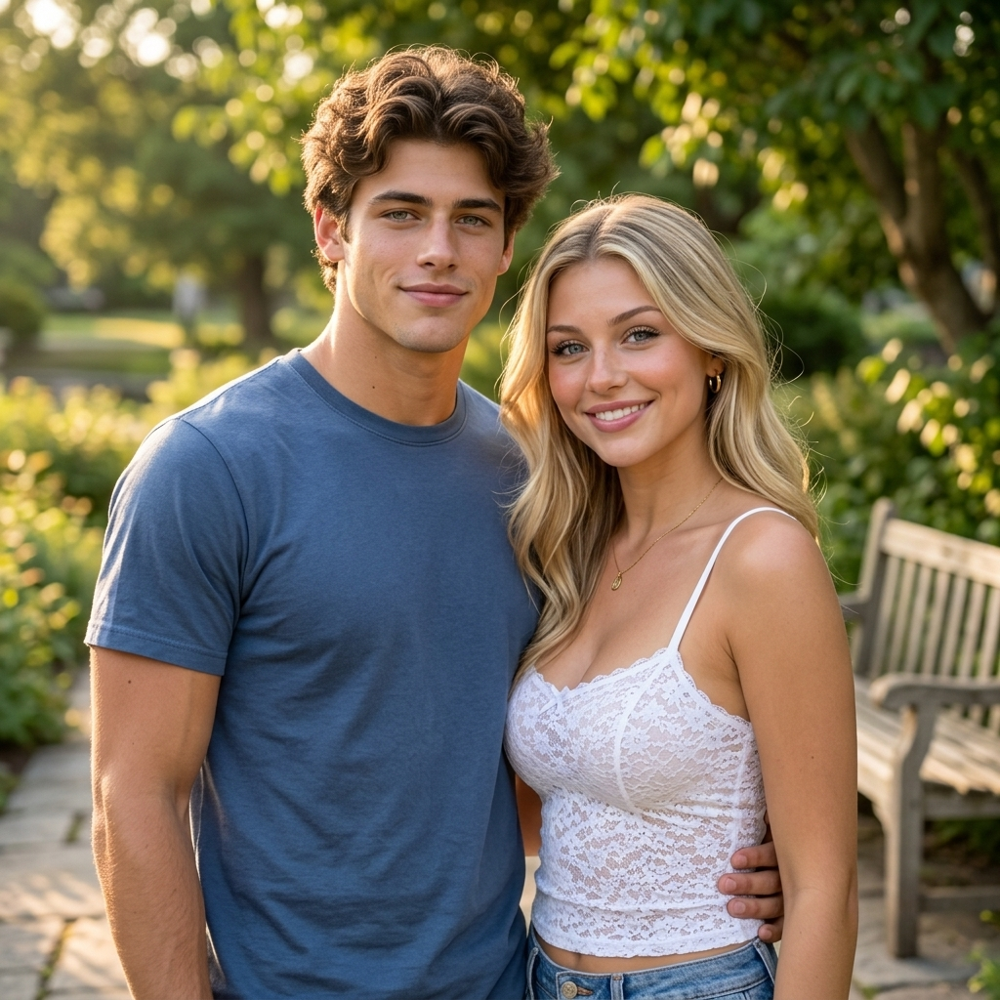

# P03 · 合照

## 🖼️ 预览

| Before | After |
| :---: | :---: |
| <a href="../../assets/portraits/reference-man.png"></a> &nbsp; <a href="../../assets/portraits/reference-woman.png"></a><br>图 1：人物 A；图 2：人物 B | <a href="../../assets/portraits/result-group-photo.jpg"></a> |

## 👇 工作流

`上传人物 A 为图 1、人物 B 为图 2 → 输入提示词 → 生成自然双人合照`

## 📝 完整提示词

```text
将图 1 中的人物与图 2 中的人物合成为一张自然合照，让两人在柔和光线的户外场景中并肩站立。分别保留两人的面部特征、年龄、肤色、发型与可辨识身份，不混合脸部，也不要把两人变成同一个人。

采用统一相机视角，以及一致的透视、尺度、光照、色温和景深。让两人神情轻松友好，姿势协调可信，手部解剖正确、间距自然。保留原有穿搭，按需要调整衣褶和阴影。输出一张照片级真实的双人合照，恰好两个人，不要分屏、边框、新增文字或拼贴接缝。
```

<sub>提示词：SeeAPI</sub>
